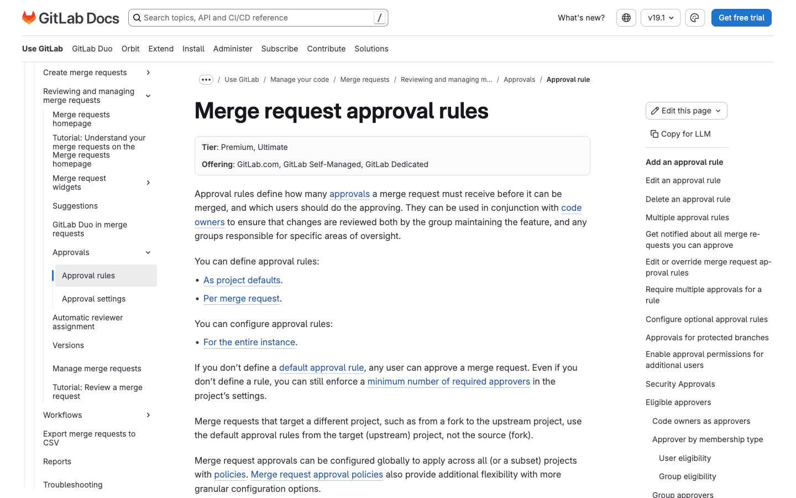
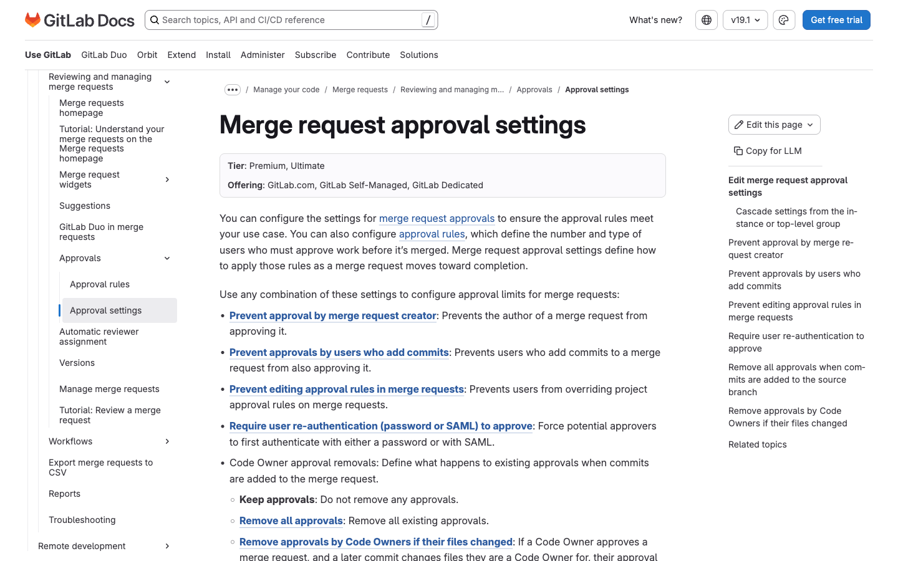
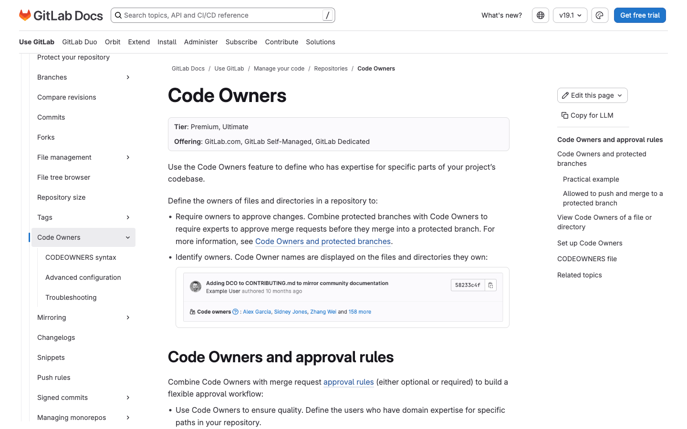
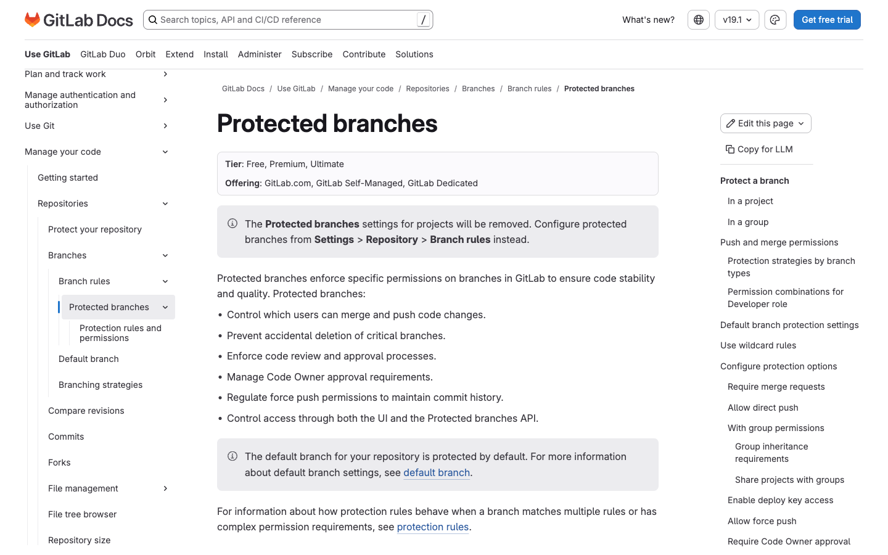
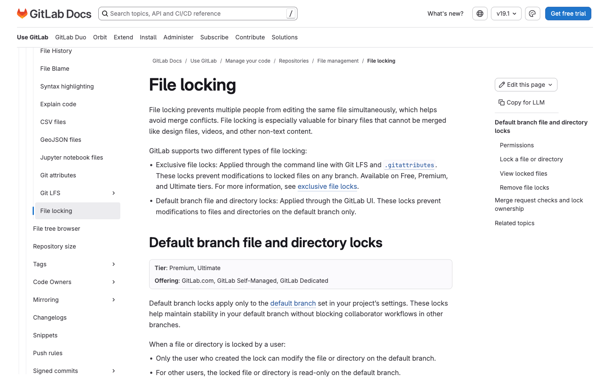
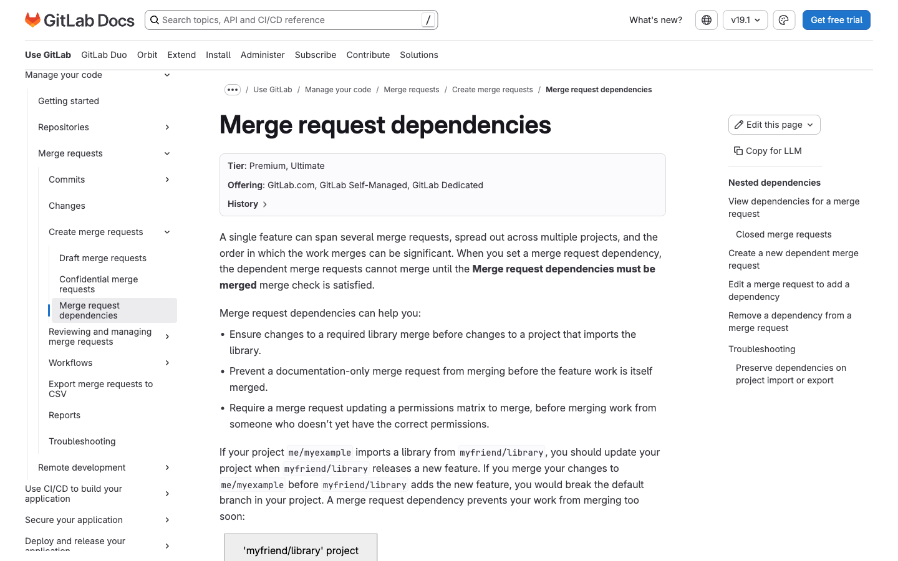

# 1. Source Code Management & Code Review

Fitur tier **Premium** & **Ultimate** untuk manajemen kode dan proses review. Tier tiap fitur diverifikasi langsung dari badge "Tier" pada docs.gitlab.com (data 2025/2026).

> **Catatan akurasi tier:** Beberapa fitur yang sering disangka berbayar sebenarnya sudah ada di **Free** — yaitu *single/batch suggestions*, *exclusive file lock via Git LFS*, dan *proteksi branch dasar per role*. Hanya varian lanjutannya yang Premium/Ultimate. Hal ini ditandai jelas di tiap bagian.

---

## 1.1 Merge Request Approval Rules

- **Tier:** Premium, Ultimate
- **WHY:** Aturan approval memastikan sebuah merge request (MR) ditinjau dan disetujui oleh jumlah serta jenis reviewer yang tepat sebelum di-merge. Ini mencegah kode masuk ke branch penting tanpa kontrol kualitas, dan memungkinkan tim membagi tanggung jawab review per area (mis. tim keamanan, tim QA). Tanpa aturan ini, approval hanya bersifat opsional dan tidak bisa dipaksakan.
- **HOW TO:**
  1. Buka project, masuk ke **Settings > Merge requests**.
  2. Pada bagian **Merge request approvals**, pilih **Approval rules**.
  3. Klik **Add approval rule**.
  4. Isi nama rule dan jumlah approval yang diperlukan (0 = opsional, 1+ = wajib, maks 100).
  5. Pada **Add approvers**, pilih user atau group yang berhak menyetujui.
  6. Klik **Save changes**. (Butuh role Maintainer atau Owner.)
  7. Untuk **multiple approval rules**, ulangi langkah 3–6 dengan approver/jumlah berbeda agar tiap domain (backend, frontend, security) wajib menyetujui dalam satu MR.
- **Docs:** https://docs.gitlab.com/user/project/merge_requests/approvals/rules/

---

## 1.2 Merge Request Approval Settings (Pengaturan Approval Lanjutan)

- **Tier:** Premium, Ultimate
- **WHY:** Pengaturan ini memperkuat integritas proses review dengan mencegah "approval palsu" — misalnya author menyetujui MR-nya sendiri atau orang yang baru menambah commit ikut menyetujui. Reset approval saat ada commit baru memastikan kode yang disetujui benar-benar kode final yang akan di-merge.
- **HOW TO:**
  1. Buka **Settings > Merge requests**.
  2. Pada bagian **Approval settings**, aktifkan opsi yang diinginkan:
     - **Prevent approval by merge request creator** (cegah author menyetujui sendiri).
     - **Prevent approvals by users who add commits**.
     - **Prevent editing approval rules in merge requests**.
     - **Remove all approvals when commits are added to the source branch** (reset approval).
     - **Remove approvals by Code Owners if their files changed**.
     - **Require user re-authentication (password atau SAML) to approve**.
  3. Klik **Save changes**.
- **Docs:** https://docs.gitlab.com/user/project/merge_requests/approvals/settings/

---

## 1.3 Code Owners

- **Tier:** Premium, Ultimate (membuat file `CODEOWNERS` bisa di semua tier; **mewajibkan approval Code Owner** butuh Premium/Ultimate)
- **WHY:** Code Owners mendefinisikan siapa pemilik/ahli untuk file atau direktori tertentu. Saat file tersebut diubah dalam MR, pemiliknya otomatis diminta meninjau dan menyetujui. Ini memastikan perubahan pada area sensitif selalu ditinjau oleh orang yang paling paham, mengurangi risiko bug dan menjaga konsistensi.
- **HOW TO:**
  1. Buat file `CODEOWNERS` di root repo, folder `docs/`, atau folder `.gitlab/`.
  2. Tulis aturan kepemilikan, mis. `*.js @frontend-team` atau `/db/ @dba`.
  3. Commit dan push file ke repository.
  4. Buka **Settings > Repository > Protected branches** dan proteksi branch target (mis. `main`).
  5. Aktifkan toggle **Require approval from Code Owners** pada branch tersebut.
- **Docs:** https://docs.gitlab.com/user/project/codeowners/

---

## 1.4 Protected Branches Lanjutan (Akses Push/Merge Granular)

- **Tier:** Proteksi dasar per role = **Free**. Penetapan **granular ke user/group spesifik**, **require Code Owner approval**, dan **group-level protected branches** = **Premium, Ultimate**.
- **WHY:** Proteksi branch lanjutan memberi kontrol presisi tentang siapa yang boleh push, merge, atau membuka proteksi pada branch penting seperti `main` atau `release`. Dengan menetapkan user/group spesifik (bukan hanya level role), organisasi membatasi akses ke branch produksi hanya pada orang terpercaya, mengurangi risiko perubahan tidak sah.
- **HOW TO:**
  1. Buka **Settings > Repository > Protected branches**.
  2. Pilih branch yang ingin diproteksi (atau gunakan wildcard, mis. `release/*`).
  3. Pada **Allowed to merge** dan **Allowed to push and merge**, pilih role, atau (Premium/Ultimate) tambahkan user/group spesifik.
  4. Aktifkan **Require approval from Code Owners** bila diperlukan.
  5. Atur **Allowed to force push** sesuai kebutuhan.
  6. Klik **Protect**.
- **Docs:** https://docs.gitlab.com/user/project/repository/branches/protected/

---

## 1.5 File Locking (Default Branch Lock via UI)

- **Tier:** **Default branch lock via UI** = **Premium, Ultimate**. **Exclusive file lock via Git LFS** = **Free, Premium, Ultimate**.
- **WHY:** File locking penting untuk file biner (aset desain, model 3D, file binary game) yang tidak bisa di-merge otomatis. Dengan mengunci file, hanya satu orang yang dapat mengeditnya pada satu waktu, mencegah konflik yang sulit/tidak mungkin diselesaikan. Default branch lock (Premium/Ultimate) dilakukan langsung dari UI tanpa konfigurasi LFS.
- **HOW TO (Default branch lock via UI):**
  1. Buka project dan navigasikan ke file atau direktori yang ingin dikunci.
  2. Untuk direktori: klik **Lock** di pojok kanan atas.
  3. Untuk file: klik menu **Actions** (titik tiga) di dekat nama file, lalu pilih **Lock**.
  4. Konfirmasi dengan memilih **OK**. (Butuh role Developer, Maintainer, atau Owner.)
- **Docs:** https://docs.gitlab.com/user/project/file_lock/

---

## 1.6 Merge Request Dependencies (Blocking Merge Requests)

- **Tier:** Premium, Ultimate
- **WHY:** Saat sebuah perubahan bergantung pada perubahan lain (mis. perubahan API harus merge sebelum perubahan yang memakainya), urutan merge menjadi krusial. Merge request dependencies memaksa MR tidak bisa di-merge sampai semua MR yang menjadi dependensinya selesai di-merge. Ini mencegah kode setengah jadi atau tidak kompatibel masuk lebih dulu.
- **HOW TO:**
  1. Buka MR dependent, klik **Edit**.
  2. Pada kolom **Merge request dependencies**, tempel referensi/URL MR yang harus merge lebih dulu (mis. `!1234`, `grup/proyek!1234`, atau URL penuh). Dependensi bisa lintas project.
  3. Klik **Save changes**.
  4. Untuk melihat: buka MR dan lihat bagian "Depends on X merge request being merged", klik **Expand**.
  5. Untuk menghapus: **Edit** MR, klik **Remove** di samping dependensi, lalu **Save changes**.
- **Docs:** https://docs.gitlab.com/user/project/merge_requests/dependencies/

---

## Ringkasan Tier — SCM & Code Review

| Fitur | Free | Premium | Ultimate |
|---|:---:|:---:|:---:|
| MR Approval Rules (single & multiple) | ❌ | ✅ | ✅ |
| Approval settings lanjutan (prevent author/committer, reset, re-auth) | ❌ | ✅ | ✅ |
| Code Owners (wajib approval) | ❌ | ✅ | ✅ |
| Protected branch granular (user/group, code owner, group-level) | ❌ | ✅ | ✅ |
| Default branch file lock via UI | ❌ | ✅ | ✅ |
| Merge request dependencies | ❌ | ✅ | ✅ |
| Reviewers dasar, single/batch suggestions, exclusive LFS lock | ✅ | ✅ | ✅ |
| Security/scan result approvals (MR approval policy) | ❌ | ❌ | ✅ |

[← Kembali ke index](README.md) · [Lanjut: CI/CD →](02-cicd.md)
