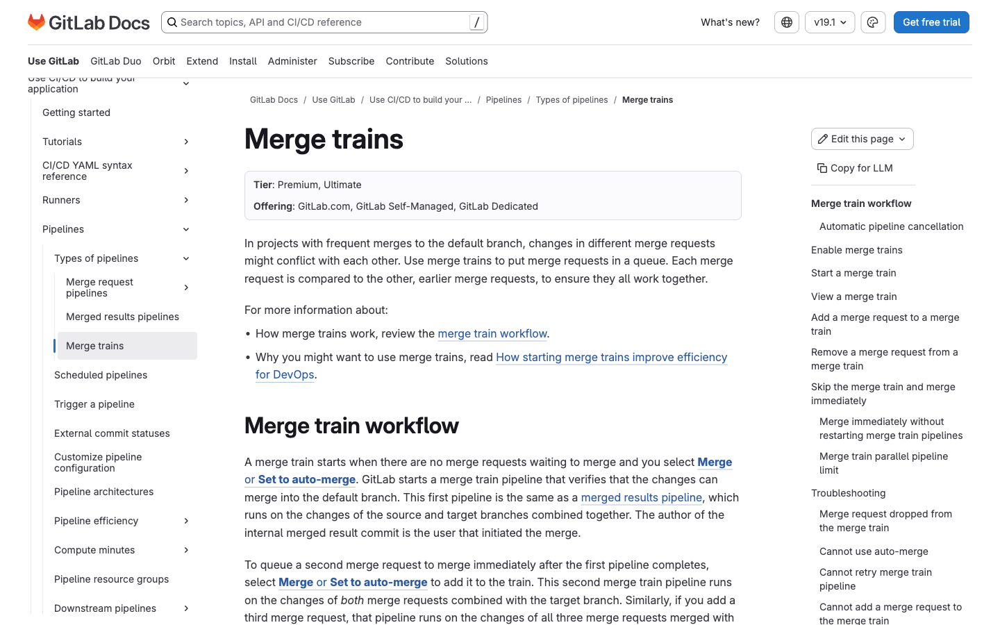
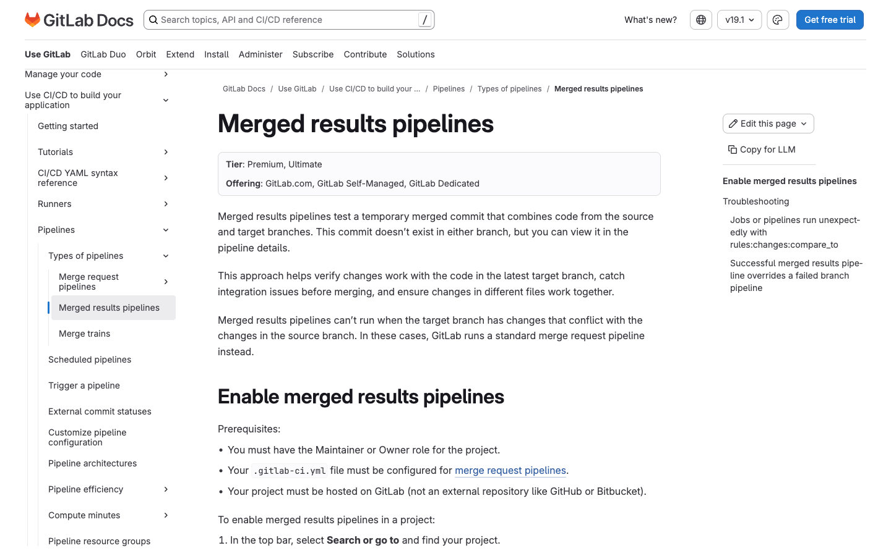
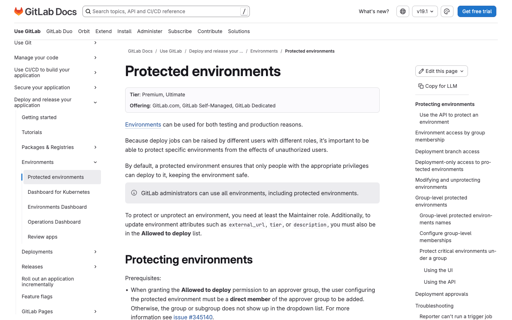
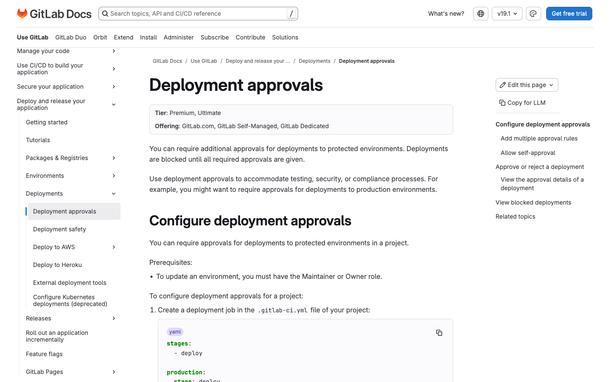
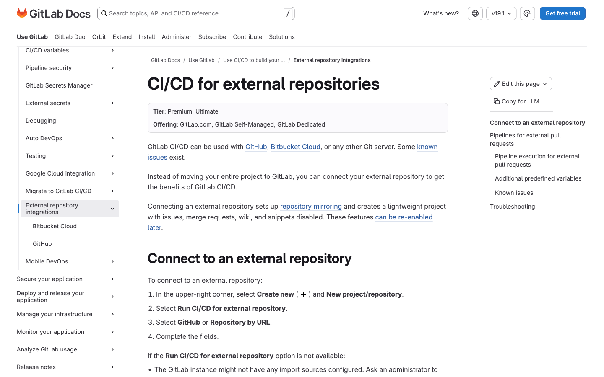
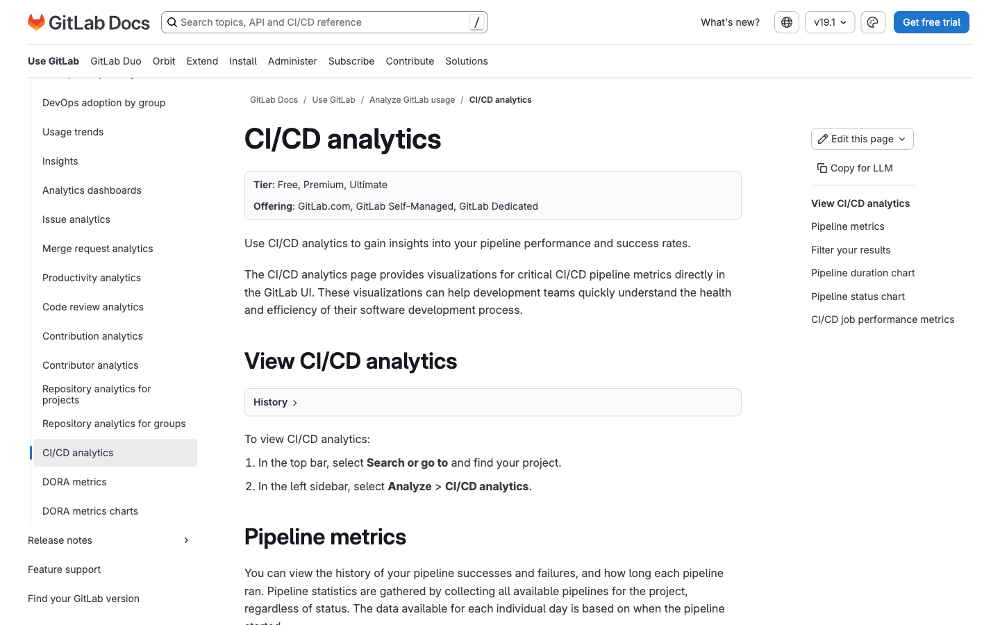

# 2. CI/CD & Pipelines

Fitur tier **Premium** & **Ultimate** untuk continuous integration & delivery. Tier diverifikasi langsung dari halaman fitur di docs.gitlab.com (2025/2026).

> **Catatan akurasi tier:** Beberapa fitur yang sering disangka Premium ternyata **sudah Free** dan TIDAK dimasukkan sebagai fitur berbayar: **Multi-project pipelines** (Free sejak 16.8), **Parent-child pipelines**, **Merge request pipelines**, **Scheduled pipelines**, dan **CI/CD analytics dasar**.

---

## 2.1 Merge Trains (Antrian Merge)

- **Tier:** Premium, Ultimate
- **WHY:** Pada proyek dengan frekuensi merge tinggi ke branch default, perubahan dari beberapa MR bisa saling konflik meski masing-masing lolos pipeline secara terpisah. Merge train menempatkan MR dalam antrian dan menguji setiap MR digabung bersama MR sebelumnya, sehingga semua perubahan dipastikan tetap kompatibel sebelum benar-benar di-merge. Ini mencegah branch default rusak akibat integrasi yang tidak teruji.
- **HOW TO:**
  1. Pastikan Anda punya role Maintainer dan **Merged results pipelines** sudah aktif (prasyarat).
  2. Buka proyek, masuk ke **Settings > Merge requests**.
  3. Pada **Merge options**, aktifkan **Enable merged results pipelines**.
  4. Aktifkan **Enable merge trains**, lalu simpan.
  5. Pada MR yang siap, pilih **Merge** atau **Set to auto-merge** untuk masuk train.
  6. Pantau posisi antrian via widget pipeline di MR; gunakan **Cancel auto-merge** untuk keluar dari train.
- **Docs:** https://docs.gitlab.com/ci/pipelines/merge_trains/

---

## 2.2 Merged Results Pipelines

- **Tier:** Premium, Ultimate
- **WHY:** MR pipeline biasa (Free) hanya menguji isi branch sumber, mengabaikan kondisi terbaru branch target. Merged results pipeline membuat commit gabungan sementara antara branch sumber dan target, lalu menjalankannya, sehingga masalah integrasi terdeteksi sebelum merge. Ini mengurangi risiko "lolos di MR tapi gagal setelah merge".
- **HOW TO:**
  1. Pastikan role Maintainer/Owner dan `.gitlab-ci.yml` sudah dikonfigurasi untuk merge request pipeline.
  2. Buka proyek, masuk ke **Settings > Merge requests**.
  3. Pada **Merge options**, centang **Enable merged results pipelines**.
  4. Simpan. Pipeline berikutnya pada MR berjalan di atas commit hasil gabungan.
- **Docs:** https://docs.gitlab.com/ci/pipelines/merged_results_pipelines/

---

## 2.3 Protected Environments (Lingkungan Terproteksi)

- **Tier:** Premium, Ultimate
- **WHY:** Job deploy dapat dipicu oleh pengguna dengan berbagai role, sehingga lingkungan penting seperti production rentan terhadap deploy tidak sah. Protected environments membatasi siapa yang boleh deploy ke lingkungan tertentu. Ini menjaga keamanan dan stabilitas lingkungan kritikal serta menjadi dasar bagi deployment approvals.
- **HOW TO:**
  1. Buka proyek, masuk ke **Settings > CI/CD**.
  2. Perluas bagian **Protected environments**.
  3. Pilih **Protect an environment**.
  4. Pilih environment dari dropdown.
  5. Tentukan **Allowed to deploy** (role/user/group yang boleh deploy).
  6. Opsional: tentukan **Approvers** dan **Approval rules**; aktifkan **Enable group inheritance** bila perlu.
  7. Klik **Protect**.
- **Docs:** https://docs.gitlab.com/ci/environments/protected_environments/

---

## 2.4 Deployment Approvals (Persetujuan Deploy)

- **Tier:** Premium, Ultimate
- **WHY:** Untuk kebutuhan compliance, security, atau testing, organisasi sering mewajibkan persetujuan manual sebelum deploy ke production. Deployment approvals memblokir deploy hingga seluruh approval yang diwajibkan diberikan. Ini menambahkan gerbang governance dan jejak audit pada proses rilis.
- **HOW TO:**
  1. Buat job deploy di `.gitlab-ci.yml` yang menyertakan keyword `environment`.
  2. Buka **Settings > CI/CD > Protected environments** dan proteksi environment terkait.
  3. Pada **Approval rules**, tentukan siapa yang boleh menyetujui dan jumlah approval yang diperlukan.
  4. Opsional: aktifkan **Allow pipeline triggerer to approve deployment** untuk self-approval.
  5. Saat pipeline berjalan, deploy menunggu approval; setelah disetujui, jalankan job deploy secara manual.
- **Docs:** https://docs.gitlab.com/ci/environments/deployment_approvals/

---

## 2.5 CI/CD for External Repositories

- **Tier:** Premium, Ultimate
- **WHY:** Tim yang masih menyimpan kode di GitHub, Bitbucket Cloud, atau Git server lain bisa memanfaatkan kekuatan GitLab CI/CD tanpa memindahkan seluruh proyek. GitLab mengatur mirroring repo dan membuat proyek ringan untuk menjalankan pipeline. Ini memungkinkan adopsi GitLab CI/CD secara bertahap, termasuk menjalankan pipeline pada konteks Pull Request GitHub.
- **HOW TO:**
  1. Pilih ikon **Create new (+) > New project/repository**.
  2. Pilih **Run CI/CD for external repository**.
  3. Pilih **GitHub** atau **Repository by URL**.
  4. Isi field yang diminta (token/URL/kredensial) untuk menyambungkan repo.
  5. Tambahkan `.gitlab-ci.yml`; GitLab akan mirror repo dan menjalankan pipeline saat ada push/PR.
- **Docs:** https://docs.gitlab.com/ci/ci_cd_for_external_repos/

---

## 2.6 CI/CD Analytics Lanjutan (Pipeline Failure Rate & Job Performance)

- **Tier:** Premium, Ultimate (untuk varian/visualisasi lanjutan; analytics dasar tersedia di Free)
- **WHY:** Visualisasi dasar (jumlah run, durasi median, success/failure rate) ada di Free, tetapi metrik lanjutan seperti **pipeline failure rate** dan **job performance metrics** (durasi P50/P95 serta failure rate per-job) hanya di Premium/Ultimate. Metrik ini membantu menemukan job bottleneck dan menurunkan biaya serta waktu pipeline secara terukur.
- **HOW TO:**
  1. Buka proyek, di sidebar kiri pilih **Analyze > CI/CD analytics**.
  2. Lihat tab metrik pipeline (total runs, median duration, success/failure rate).
  3. Gunakan filter berdasarkan source, branch, dan rentang tanggal.
  4. Tinjau panel durasi P50/P95 dan failure rate per job untuk mengidentifikasi bottleneck.
- **Docs:** https://docs.gitlab.com/user/analytics/ci_cd_analytics/

---

## Fitur CI/CD Premium/Ultimate Lain (tanpa screenshot terpisah)

| Fitur | Tier | Ringkasan |
|---|---|---|
| **Pipeline subscriptions** | Premium, Ultimate | Memicu pipeline branch default proyek hilir otomatis saat pipeline tag proyek hulu (public) selesai. Konfigurasi via **Settings > CI/CD > Pipeline subscriptions**. ([docs](https://docs.gitlab.com/ci/pipelines/downstream_pipelines/)) |
| **Minimum role to cancel pipeline/job** | Premium, Ultimate | Batasi hak membatalkan pipeline (Maintainer/Owner/No one) via **Settings > CI/CD > General pipelines**. ([docs](https://docs.gitlab.com/ci/pipelines/settings/)) |
| **Browser performance testing** | Premium, Ultimate | Ukur performa rendering web (sitespeed.io); hasil dibandingkan di widget MR. ([docs](https://docs.gitlab.com/ci/testing/browser_performance_testing/)) |
| **Load performance testing** | Premium, Ultimate | Uji beban backend dengan k6; regresi performa server terdeteksi di MR. ([docs](https://docs.gitlab.com/ci/testing/load_performance_testing/)) |
| **Compute minutes (kuota)** | Semua tier (kuota berbeda) | Free ~400/bln, Premium ~10.000/bln, Ultimate ~50.000/bln (indikatif SaaS). ([docs](https://docs.gitlab.com/ci/pipelines/compute_minutes/)) |

[← Sebelumnya: SCM](01-source-code-management.md) · [Kembali ke index](README.md) · [Lanjut: Security & Compliance →](03-security-compliance.md)
