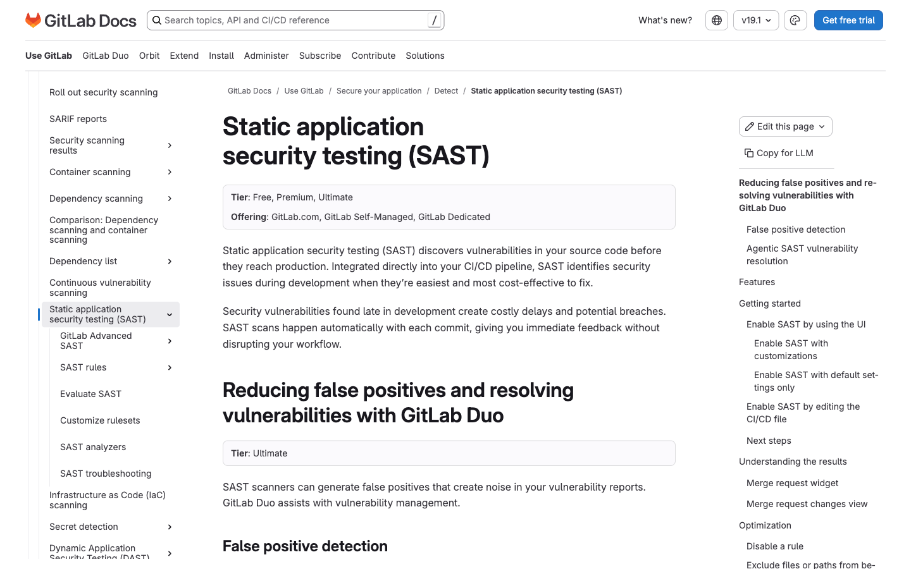
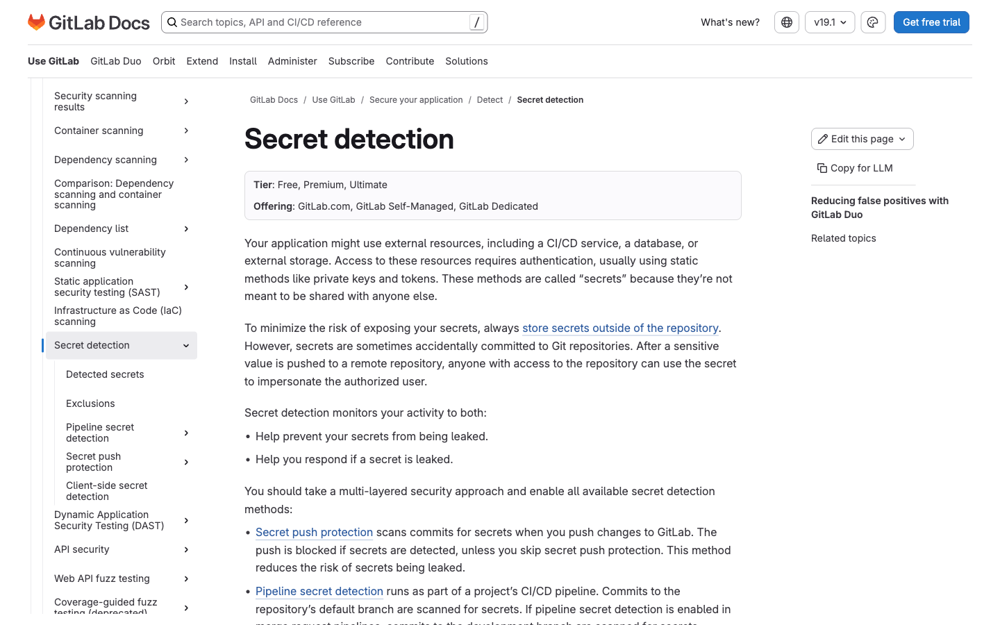
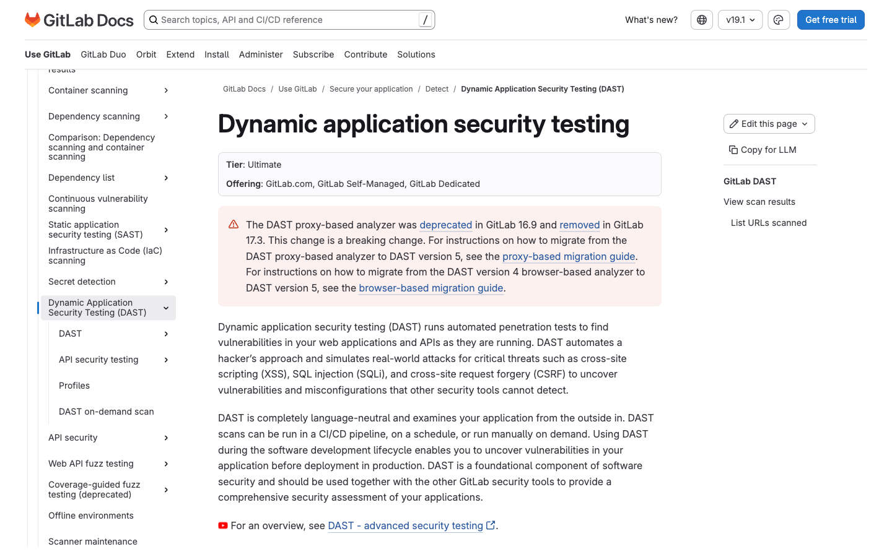
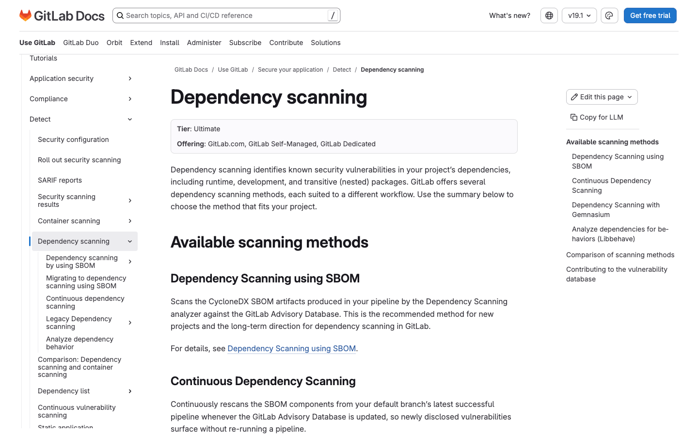
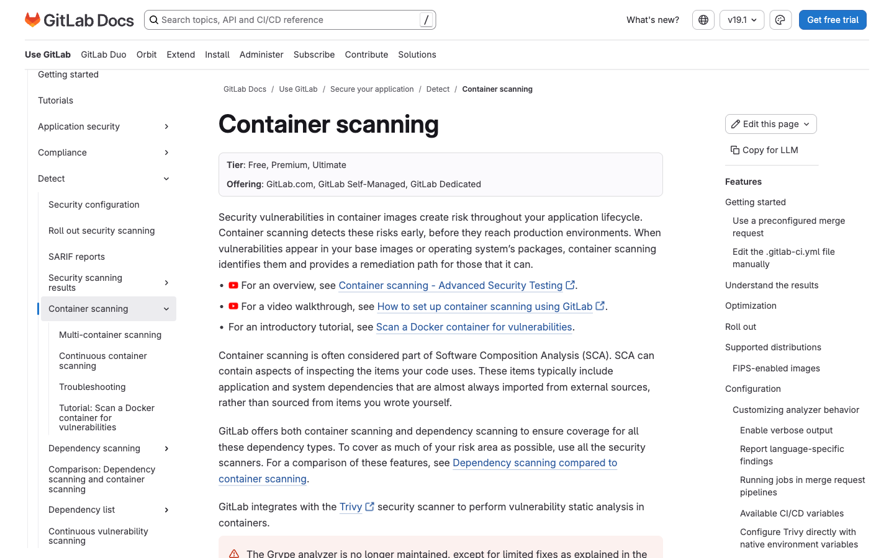
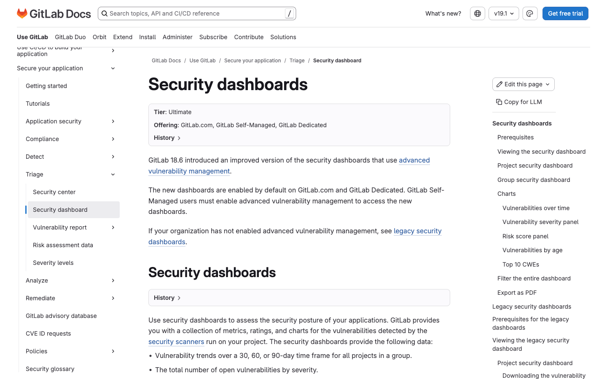
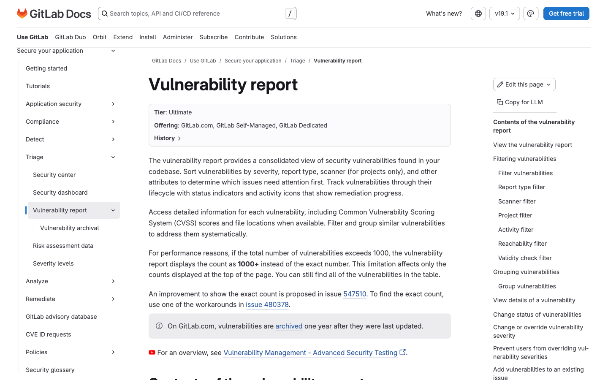
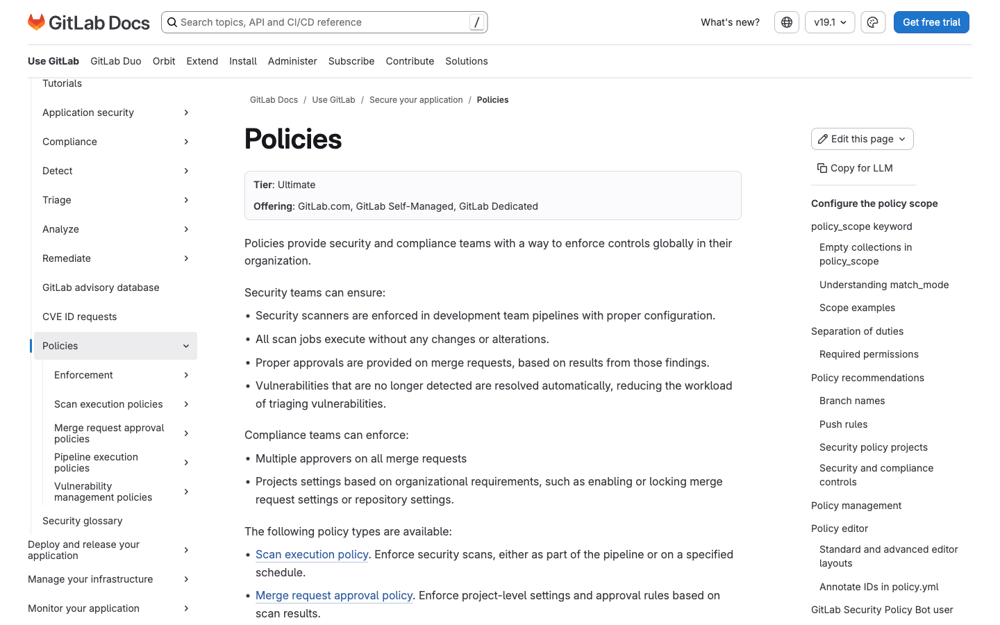
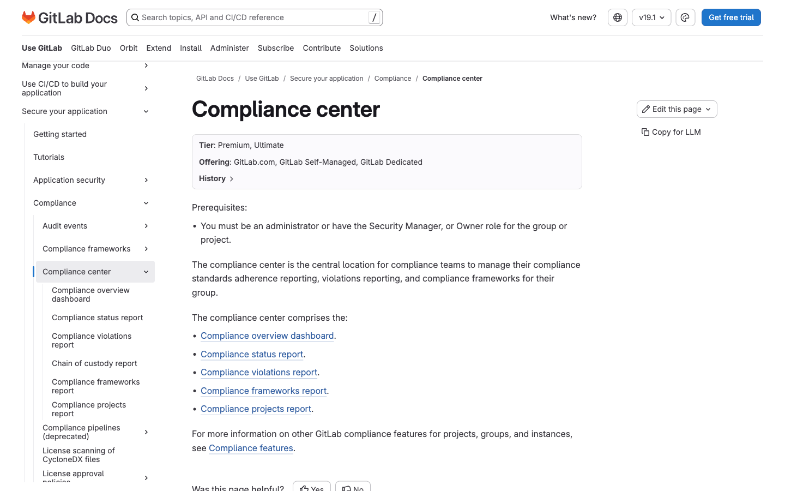
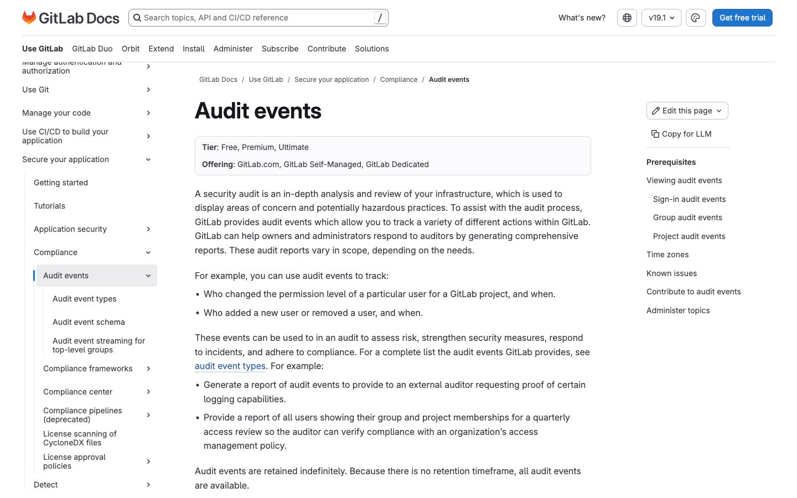

# 3. Security & Compliance (DevSecOps)

Kategori paling kuat untuk **Ultimate**. Tier diverifikasi dari docs.gitlab.com (2025/2026).

> **Catatan akurasi tier:** Beberapa *scanner dasar* (SAST, Secret Detection, Container Scanning) kini tersedia di **semua tier termasuk Free**, tetapi fitur **manajemennya** — MR security widget, Vulnerability Report, Security Dashboard, Dependency List, Security Policies — tetap **Ultimate**.

---

## 3.1 SAST (Static Application Security Testing)



- **Tier:** Free/Premium/Ultimate (scanning dasar). Fitur manajemen (MR widget, vulnerability management, false-positive detection, agentic resolution) hanya **Ultimate**.
- **WHY:** SAST memindai kode sumber dan binary untuk menemukan kerentanan (mis. SQL injection, hardcoded secret) sebelum kode masuk produksi. Mendeteksi masalah lebih awal di pipeline CI/CD membuat biaya perbaikan jauh lebih murah dibanding setelah rilis. Hasil ditampilkan otomatis di setiap pipeline sehingga developer mendapat umpan balik keamanan berkelanjutan.
- **HOW TO:**
  1. Buka **Secure > Security configuration** (Ultimate bisa klik "Configure SAST" lewat UI).
  2. Atau tambahkan ke `.gitlab-ci.yml`:
     ```yaml
     include:
       - template: Jobs/SAST.gitlab-ci.yml
     ```
  3. Pastikan ada stage `test` dan runner Linux dengan executor Docker/Kubernetes.
  4. Jalankan pipeline; hasil muncul di tab Security pipeline (dan widget MR pada Ultimate).
  5. Tindak lanjuti temuan melalui Vulnerability Report.
- **Catatan Ultimate:** **GitLab Advanced SAST** menambah analisis *cross-file/cross-function* (taint analysis) — aktifkan dengan variabel `GITLAB_ADVANCED_SAST_ENABLED: "true"`.
- **Docs:** https://docs.gitlab.com/user/application_security/sast/

---

## 3.2 Secret Detection



- **Tier:** Free/Premium/Ultimate (pipeline secret detection & secret push protection). Validity checks & false-positive detection (Duo) hanya **Ultimate**.
- **WHY:** Secret Detection mencari kredensial yang tidak sengaja ter-commit seperti API key, token, dan password. Kredensial yang bocor adalah salah satu penyebab utama insiden keamanan, dan begitu masuk histori Git sulit dihapus. Pendekatan berlapis (saat push, di pipeline, dan sisi klien) mencegah rahasia masuk maupun mendeteksi yang sudah ada.
- **HOW TO:**
  1. Aktifkan **Secret push protection** di **Settings > Security configuration** agar commit yang mengandung rahasia diblokir saat push.
  2. Aktifkan **Pipeline secret detection** dengan menambahkan ke `.gitlab-ci.yml`:
     ```yaml
     include:
       - template: Jobs/Secret-Detection.gitlab-ci.yml
     ```
  3. Aktifkan **Client-side detection** untuk memeriksa deskripsi/komentar issue & MR.
  4. Jalankan pipeline; rahasia terdeteksi muncul sebagai temuan.
  5. Rotasi/cabut kredensial yang terdeteksi dan bersihkan dari histori.
- **Docs:** https://docs.gitlab.com/user/application_security/secret_detection/

---

## 3.3 DAST (Dynamic Application Security Testing)



- **Tier:** Ultimate
- **WHY:** DAST menjalankan uji penetrasi otomatis terhadap aplikasi web yang berjalan untuk menemukan kerentanan runtime seperti XSS, SQLi, dan CSRF yang tidak terdeteksi analisis statis. Ia mensimulasikan serangan dunia nyata dari sudut pandang penyerang. Cocok untuk memvalidasi keamanan aplikasi pada staging sebelum produksi.
- **HOW TO:**
  1. Siapkan environment aplikasi yang sudah dideploy & dapat diakses (review app/staging).
  2. Tambahkan template DAST di `.gitlab-ci.yml` dan tentukan target URL (`DAST_WEBSITE`).
  3. Jalankan scan di pipeline, terjadwal, atau on-demand.
  4. Tinjau hasil di MR, tab Security pipeline, atau Vulnerability Report.
- **Catatan:** GitLab juga menyediakan **API Security Testing (DAST API)** untuk REST/GraphQL/SOAP berbasis OpenAPI/HAR/Postman (Ultimate).
- **Docs:** https://docs.gitlab.com/user/application_security/dast/

---

## 3.4 Dependency Scanning



- **Tier:** Ultimate
- **WHY:** Dependency Scanning mendeteksi kerentanan pada library pihak ketiga (open source) yang dipakai proyek — sumber risiko terbesar dalam supply chain modern. Pemindaian berbasis SBOM (CycloneDX) dicocokkan dengan GitLab Advisory Database. *Continuous Dependency Scanning* bahkan memindai ulang otomatis saat ada advisory baru tanpa menjalankan ulang pipeline.
- **HOW TO:**
  1. Tambahkan template dependency scanning ke `.gitlab-ci.yml` (menghasilkan SBOM CycloneDX).
  2. Pastikan manifest dependensi ada di repo.
  3. Jalankan pipeline; SBOM dicocokkan dengan Advisory Database.
  4. (Opsional) Aktifkan Continuous Dependency Scanning untuk rescan otomatis.
  5. Tinjau kerentanan di Vulnerability Report dan Dependency List.
- **Docs:** https://docs.gitlab.com/user/application_security/dependency_scanning/

---

## 3.5 Container Scanning



- **Tier:** Free/Premium/Ultimate (di Ultimate diperkaya GitLab Advisory Database penuh).
- **WHY:** Container Scanning mendeteksi kerentanan pada image kontainer (OS package & dependensi di dalam image) sebelum dideploy. Karena banyak aplikasi berjalan dalam kontainer, kerentanan di base image dapat menyebar ke produksi. Pemindaian dini memberi jalur remediasi sebelum risiko mencapai produksi.
- **HOW TO:**
  1. Build dan push image ke container registry terlebih dahulu.
  2. Buka **Secure > Security configuration** lalu **Configure with a merge request** pada Container Scanning, atau tambahkan manual:
     ```yaml
     include:
       - template: Jobs/Container-Scanning.gitlab-ci.yml
     ```
  3. Pastikan ada stage `test` dan runner Linux/amd64.
  4. Jalankan pipeline; image dipindai otomatis.
  5. Tinjau temuan di tab Security pipeline / Vulnerability Report.
- **Docs:** https://docs.gitlab.com/user/application_security/container_scanning/

---

## 3.6 Security Dashboard



- **Tier:** Ultimate
- **WHY:** Security Dashboard memberi pandangan agregat kerentanan pada branch default di tingkat proyek dan grup, lengkap dengan tren 30/60/90 hari, breakdown severity, dan top CWE. Ini membantu tim keamanan memantau postur risiko dan memprioritaskan perbaikan. Tampilan grup memungkinkan oversight lintas banyak proyek sekaligus.
- **HOW TO:**
  1. Pastikan scanner keamanan sudah dikonfigurasi & berhasil scan di branch default.
  2. Buka proyek/grup, lalu **Secure > Security dashboard**.
  3. Gunakan filter (jenis report, proyek, severity) untuk menyesuaikan chart.
  4. Analisis tren & severity untuk prioritisasi.
  5. (Opsional) Export dashboard sebagai PDF untuk pelaporan.
- **Docs:** https://docs.gitlab.com/user/application_security/security_dashboard/

---

## 3.7 Vulnerability Report & Management



- **Tier:** Ultimate
- **WHY:** Vulnerability Report menampilkan hasil kumulatif dari semua job scan keamanan pada branch default sebagai satu daftar yang dapat ditriase. Ini menjadi pusat kerja tim keamanan untuk mengubah status, menetapkan severity, dan menautkan kerentanan ke issue remediasi. Tanpa pusat ini, temuan dari banyak scanner tersebar dan sulit dikelola.
- **HOW TO:**
  1. Buka proyek/grup, pilih **Secure > Vulnerability report**.
  2. Filter berdasarkan severity, status, jenis report, atau scanner.
  3. Group temuan (mis. by OWASP category) untuk tinjauan sistematis.
  4. Pilih kerentanan lalu ubah status via "Set status" (mis. dismiss dengan alasan).
  5. Tautkan ke issue untuk pelacakan remediasi; export ke CSV bila perlu.
- **Docs:** https://docs.gitlab.com/user/application_security/vulnerability_report/

---

## 3.8 Security Policies



- **Tier:** Ultimate (semua jenis policy)
- **WHY:** Security Policies menegakkan kontrol keamanan secara terpusat tanpa bergantung pada konfigurasi tiap proyek. **Scan execution policy** mewajibkan scan berjalan; **Merge request approval policy** memblokir merge bila ada temuan yang melanggar aturan (mis. ada kerentanan critical); **Pipeline execution policy** menyisipkan job CI/CD wajib; **Vulnerability management policy** otomatis menyelesaikan kerentanan yang sudah tidak terdeteksi. Ini memastikan standar keamanan konsisten di seluruh organisasi.
- **HOW TO:**
  1. Buka proyek/grup, pilih **Secure > Policies**.
  2. Klik **New policy** dan pilih jenis policy yang diinginkan.
  3. Definisikan aturan via Rule mode (visual) atau YAML mode.
  4. Pilih **Configure with a merge request** untuk memvalidasi & menyimpan.
  5. Review dan merge MR; GitLab otomatis membuat security policy project untuk enforcement.
- **Docs:** https://docs.gitlab.com/user/application_security/policies/

---

## 3.9 Compliance Center & Frameworks



- **Tier:** Premium & Ultimate (enforcement pipeline/policy via framework: Ultimate)
- **WHY:** Compliance Center adalah lokasi pusat tim kepatuhan untuk memantau adherence terhadap standar, melihat laporan pelanggaran (violations), dan mengelola compliance frameworks. **Compliance Frameworks** memberi label kepatuhan (SOC 2, GDPR, custom) pada proyek dan, di Ultimate, dapat menegakkan konfigurasi pipeline serta security policy ke proyek yang dilabeli. Group owner dapat menetapkan framework default agar otomatis diterapkan ke proyek baru.
- **HOW TO:**
  1. Buka grup/proyek, lalu **Secure > Compliance center**.
  2. Gunakan **Compliance overview dashboard** untuk memantau status keseluruhan.
  3. Tinjau **Compliance status report** dan **Compliance violations report**.
  4. Di tab **Frameworks**, buat framework (template/JSON/custom) dan tambahkan requirements.
  5. Di tab **Projects**, pilih **Edit Framework**, pilih proyek, lalu **Update Framework**.
  6. (Ultimate) Kaitkan pipeline execution policy/security policy ke framework untuk enforcement.
- **Docs:** https://docs.gitlab.com/user/compliance/compliance_center/

---

## 3.10 Audit Events & Reports



- **Tier:** Free (hanya event sign-in), **Premium & Ultimate** (audit event grup/proyek/instance lengkap). **Streaming ke destinasi eksternal: Ultimate**.
- **WHY:** Audit Events mencatat aktivitas penting (perubahan setting, akses, perubahan keanggotaan) untuk akuntabilitas, investigasi insiden, dan kepatuhan regulasi. Riwayat ini krusial saat audit eksternal atau forensik keamanan. Di Ultimate, event dapat di-stream ke SIEM eksternal untuk analisis lanjutan.
- **HOW TO:**
  1. Event sign-in (semua tier): avatar > **Edit profile > Access > Authentication log**.
  2. Audit grup (Premium+): buka grup, lalu **Secure > Audit events**.
  3. Audit proyek (Premium+): buka proyek, lalu **Secure > Audit events**.
  4. Filter berdasarkan user dan rentang tanggal (maks 30 hari per query).
  5. (Ultimate) Konfigurasikan streaming destination untuk mengirim event ke sistem eksternal.
- **Docs:** https://docs.gitlab.com/user/compliance/audit_events/

---

## Fitur Security/Compliance Lain (tanpa screenshot terpisah)

| Fitur | Tier | Ringkasan |
|---|---|---|
| **License Compliance / Scanning** | Ultimate | Identifikasi lisensi open source (600+ SPDX) dari SBOM; bisa diblokir via MR approval policy. ([docs](https://docs.gitlab.com/user/compliance/license_scanning_of_cyclonedx_files/)) |
| **Dependency List (SBOM)** | Ultimate | Daftar seluruh dependensi + kerentanan + lisensi; export JSON/CSV/CycloneDX. ([docs](https://docs.gitlab.com/user/application_security/dependency_list/)) |
| **Operational Container Scanning** | Ultimate | Scan image yang berjalan di cluster Kubernetes (runtime), terjadwal via agent. ([docs](https://docs.gitlab.com/user/clusters/agent/vulnerabilities/)) |
| **Coverage-guided Fuzz Testing** | Ultimate | Fuzzing terinstrumentasi (⚠️ deprecated 18.0, dihapus 19.0). ([docs](https://docs.gitlab.com/user/application_security/coverage_fuzzing/)) |
| **Pipeline Execution Policy** | Ultimate | Penerus Compliance Pipelines; inject job CI/CD wajib ke proyek ber-framework. ([docs](https://docs.gitlab.com/user/compliance/compliance_pipelines/)) |

[← Sebelumnya: CI/CD](02-cicd.md) · [Kembali ke index](README.md) · [Lanjut: Agile & Portfolio →](04-agile-portfolio.md)
