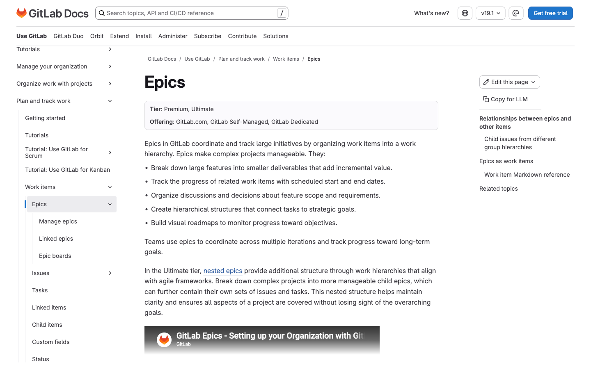
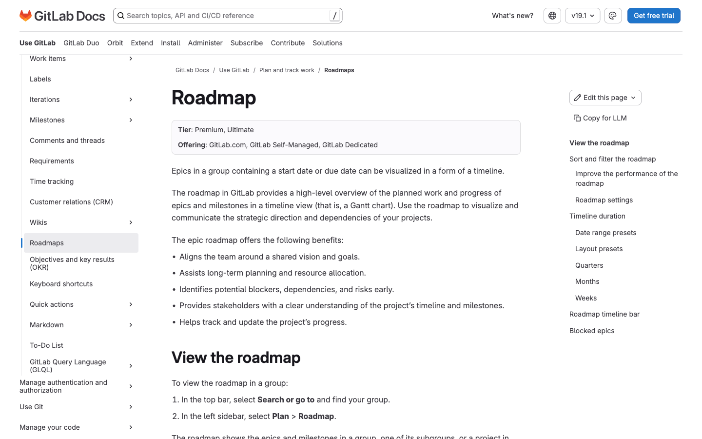
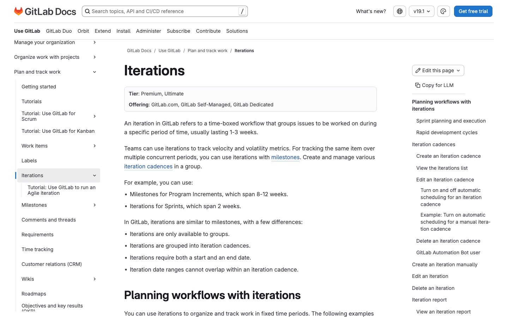
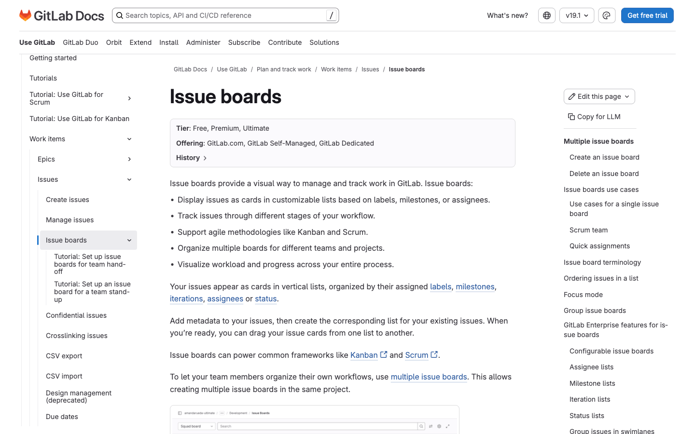
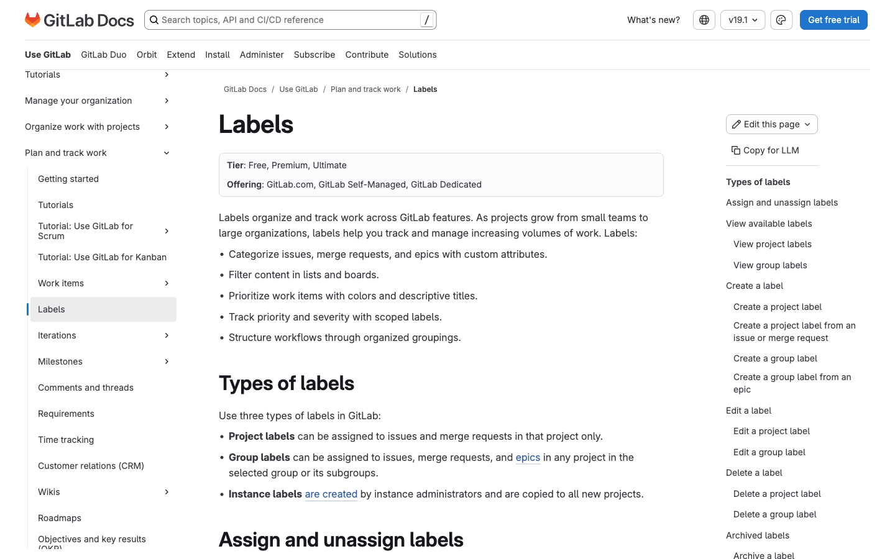
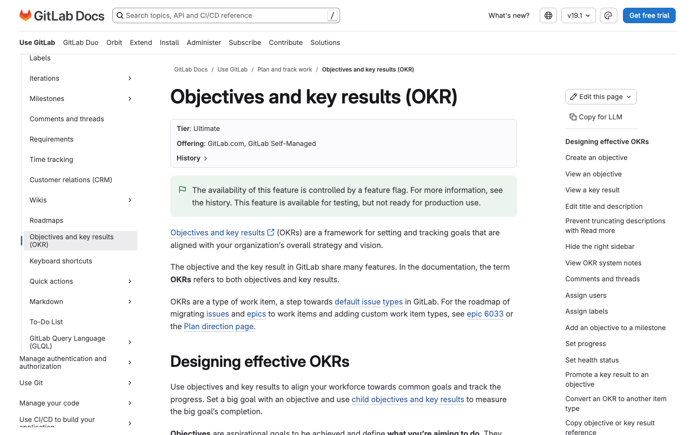
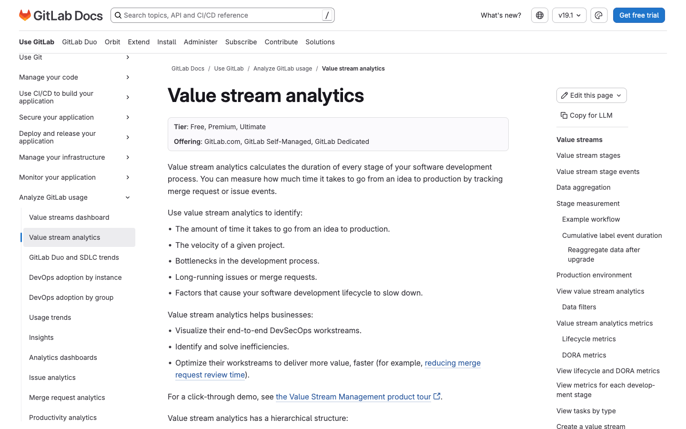
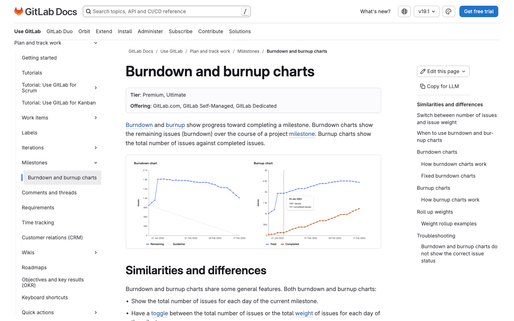

# 4. Agile Planning & Portfolio Management

Fitur tier **Premium** & **Ultimate** untuk perencanaan agile dan manajemen portofolio. Tier diverifikasi dari badge "Tier" di docs.gitlab.com (2025/2026).

> **Catatan akurasi tier:** Beberapa fitur yang dulu Ultimate kini turun ke **Premium**: **Epics**, **Roadmap**, **Multiple issue assignees**, **Issue weights**, dan **Scoped labels**. Fitur level-portofolio & analitik lanjutan tetap **Ultimate**: Multi-level epics, Health status, Requirements, OKRs, Insights, DORA metrics.

---

## 4.1 Epics

- **Tier:** Premium, Ultimate (sebelumnya Ultimate)
- **WHY:** Epic memungkinkan tim memecah fitur besar menjadi deliverable kecil yang memberi nilai inkremental. Epic mengelompokkan issue terkait dengan tanggal mulai/selesai sehingga progres terhadap tujuan strategis bisa dilacak. Ini menjadi fondasi perencanaan lintas iterasi dan jembatan antara pekerjaan harian dengan sasaran jangka panjang.
- **HOW TO:**
  1. Pilih **Search or go to** di bar atas lalu cari grup Anda.
  2. Di sidebar kiri pilih **Plan > Epics**.
  3. Klik **New epic**.
  4. Isi judul, deskripsi, tanggal mulai & due date, label, serta assignee.
  5. Klik **Create epic**.
- **Multi-level / Portfolio Epics (Ultimate):** buka epic parent → bagian **Child items** → **Add > New epic** (hierarki hingga 7 level, selaras Portfolio SAFe).
- **Docs:** https://docs.gitlab.com/user/group/epics/

---

## 4.2 Roadmaps

- **Tier:** Premium, Ultimate
- **WHY:** Roadmap menampilkan ikhtisar tingkat tinggi pekerjaan terencana dan progres epic serta milestone dalam tampilan timeline (Gantt chart). Berguna untuk mengomunikasikan arah strategis, mengidentifikasi dependensi, dan memantau progres lintas tim. Tim Ultimate juga dapat melihat child epic dan milestone terkait langsung di roadmap.
- **HOW TO:**
  1. Pilih **Search or go to** lalu cari grup Anda.
  2. Di sidebar kiri pilih **Plan > Roadmap**.
  3. Gunakan filter (rentang tanggal, label, milestone) untuk menyaring tampilan.
  4. Klik ikon chevron untuk meng-expand child epic.
  5. Arahkan kursor ke bar epic untuk melihat tanggal mulai, due date, dan weight.
- **Docs:** https://docs.gitlab.com/user/group/roadmap/

---

## 4.3 Iterations & Iteration Cadences

- **Tier:** Premium, Ultimate
- **WHY:** Iteration adalah workflow time-boxed (1–3 minggu) untuk mengelompokkan issue yang dikerjakan dalam periode tertentu — ideal untuk Scrum/sprint. Iteration cadence mengotomatiskan penjadwalan iterasi berulang sehingga tim tidak perlu membuatnya manual. Mendukung pelacakan velocity dan roll over issue yang belum selesai.
- **HOW TO:**
  1. Cari grup Anda, masuk ke **Plan > Iterations**.
  2. Klik **New iteration cadence**.
  3. Isi judul dan deskripsi cadence.
  4. Tentukan tanggal mulai otomatis, durasi (1–4 minggu), dan jumlah iterasi mendatang.
  5. (Opsional) Aktifkan **roll over** untuk memindahkan issue belum selesai ke iterasi berikutnya.
  6. Klik **Create cadence**.
- **Docs:** https://docs.gitlab.com/user/group/iterations/

---

## 4.4 Issue Boards Lanjutan

- **Tier:** Satu board dasar = **Free**. **Multiple boards level grup, configurable/scoped board, list milestone/assignee/iteration** = **Premium, Ultimate**.
- **WHY:** Board lanjutan memungkinkan banyak board per proyek/grup dengan scope dan filter berbeda untuk berbagai sudut pandang alur kerja. List berbasis assignee, milestone, dan iteration mengubah board menjadi alat manajemen kapasitas & perencanaan sprint, bukan sekadar kanban label. Krusial untuk tim yang memvisualkan beban kerja per orang atau per milestone.
- **HOW TO:**
  1. Buka **Plan > Issue boards** (proyek atau grup).
  2. Klik dropdown nama board di kiri atas lalu **Create new board**.
  3. Beri nama, atur scope (milestone, iteration, label, assignee, weight), klik **Create board**.
  4. Klik **New list**, pilih tipe (Label, Assignee, Milestone, Iteration, Status).
  5. Pilih item dari dropdown lalu **Add to board**.
- **Docs:** https://docs.gitlab.com/user/project/issue_board/

---

## 4.5 Scoped Labels

- **Tier:** Premium, Ultimate
- **WHY:** Scoped label membuat label yang saling eksklusif menggunakan sintaks double-colon, mis. `workflow::in-review`. Item tidak bisa punya dua label dengan key scope yang sama, sehingga otomatis menjaga konsistensi data (mis. status atau prioritas tunggal). Memungkinkan custom field dan workflow kompleks tanpa konflik label.
- **HOW TO:**
  1. Saat membuat label baru, sertakan `::` pada judul, mis. `priority::high`.
  2. GitLab memperlakukan teks sebelum `::` terakhir sebagai scope.
  3. Terapkan label dari sidebar issue/epic seperti label biasa.
  4. Saat memberi label dengan scope sama, label lama dengan key tersebut otomatis tergantikan.
  5. Filter dengan wildcard, mis. `priority::*`.
- **Docs:** https://docs.gitlab.com/user/project/labels/

---

## 4.6 OKRs (Objectives & Key Results)

- **Tier:** Ultimate
- **WHY:** OKR adalah kerangka penetapan dan pelacakan sasaran yang selaras dengan strategi organisasi. **Objective** menyatakan tujuan aspiratif, sedangkan **Key Result** mengukur progres menuju tujuan tersebut. Mengelola OKR langsung di GitLab menyatukan strategi level atas dengan epic/issue eksekusi sehari-hari.
- **HOW TO:**
  1. Cari proyek Anda, masuk ke **Plan > Work items**.
  2. Klik **New item**, pilih tipe **Objective**, isi judul, klik **Create objective**.
  3. Buka objective tersebut.
  4. Pada bagian **Child items**, pilih **Add > New key result**.
  5. Isi judul key result, pilih proyek, lalu **Create key result**.
- **Docs:** https://docs.gitlab.com/user/okrs/

---

## 4.7 Value Stream Analytics & Value Streams Dashboard

- **Tier:** VSA dasar **Free/Premium/Ultimate**; **custom value stream & agregasi: Premium/Ultimate**; **DORA metrics: Ultimate**. Value Streams Dashboard: **Premium, Ultimate**.
- **WHY:** VSA mengukur waktu yang dibutuhkan pekerjaan melewati setiap tahap value stream, membantu mengidentifikasi bottleneck dan mempercepat delivery. Custom value stream (Premium+) memungkinkan pemetaan tahapan sesuai proses nyata tim. Value Streams Dashboard memberi visibilitas lintas grup/proyek, dan DORA metrics (Ultimate) menambah pengukuran performa DevOps kelas industri.
- **HOW TO:**
  1. Buka grup/proyek lalu pilih **Analyze > Value stream analytics**.
  2. Tinjau metrik lifecycle dan durasi tiap tahap; gunakan filter.
  3. (Premium+) Buat custom value stream lewat **Create value stream** untuk mendefinisikan tahapan sendiri.
  4. Untuk dashboard, pada baris **Lifecycle metrics** pilih **Value Streams Dashboard / DORA**.
- **Docs:** https://docs.gitlab.com/user/group/value_stream_analytics/

---

## 4.8 Burndown & Burnup Charts

- **Tier:** Premium, Ultimate
- **WHY:** Burndown chart menampilkan sisa pekerjaan dari waktu ke waktu, sedangkan burnup chart melacak pekerjaan selesai sekaligus perubahan scope. Keduanya membantu tim memantau apakah milestone/sprint berjalan sesuai jadwal. Chart bisa berbasis jumlah issue atau total weight untuk akurasi estimasi.
- **HOW TO:**
  1. Buka proyek atau grup via bar pencarian.
  2. Masuk ke **Plan > Milestones**.
  3. Pilih milestone yang diinginkan.
  4. Lihat burndown & burnup chart pada halaman detail milestone.
  5. Alihkan tampilan antara basis **issue count** dan **issue weight**.
- **Docs:** https://docs.gitlab.com/user/project/milestones/burndown_and_burnup_charts/

---

## Fitur Agile/Portfolio Lain (tanpa screenshot terpisah)

| Fitur | Tier | Ringkasan |
|---|---|---|
| **Multiple issue assignees** | Premium, Ultimate | Beberapa orang per issue untuk kepemilikan bersama. ([docs](https://docs.gitlab.com/user/project/issues/multiple_assignees_for_issues/)) |
| **Issue/Work item weights** | Premium, Ultimate | Estimasi numerik effort untuk kapasitas & velocity. ([docs](https://docs.gitlab.com/user/work_items/weight/)) |
| **Health status** | Ultimate | Indikator On track / Needs attention / At risk per issue. ([docs](https://docs.gitlab.com/user/project/issues/managing_issues/)) |
| **Requirements management** | Ultimate | Artefak requirement + traceability untuk industri teregulasi. ([docs](https://docs.gitlab.com/user/project/requirements/)) |
| **Insights** | Ultimate | Grafik kustom via `.gitlab/insights.yml` untuk tren jangka panjang. ([docs](https://docs.gitlab.com/user/project/insights/)) |
| **Epic boards** | Premium, Ultimate | Kanban berbasis label untuk epic (level portofolio). ([docs](https://docs.gitlab.com/user/group/epics/epic_boards/)) |

[← Sebelumnya: Security & Compliance](03-security-compliance.md) · [Kembali ke index](README.md) · [Lanjut: Administration & Enterprise →](05-administration-enterprise.md)
