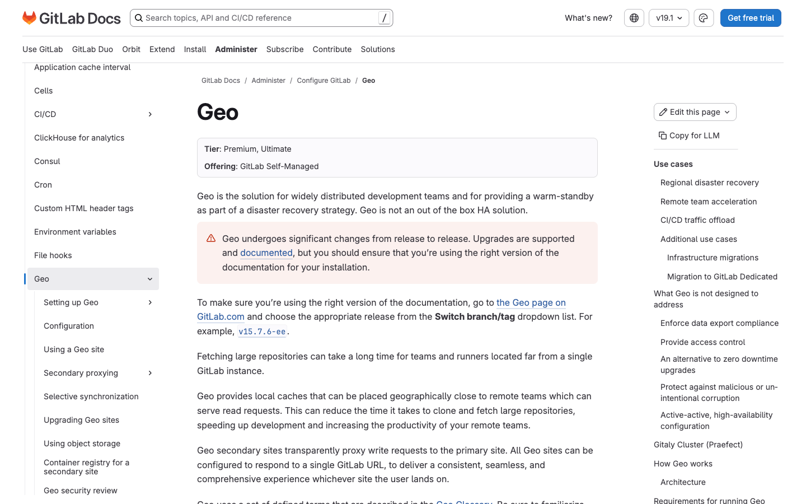
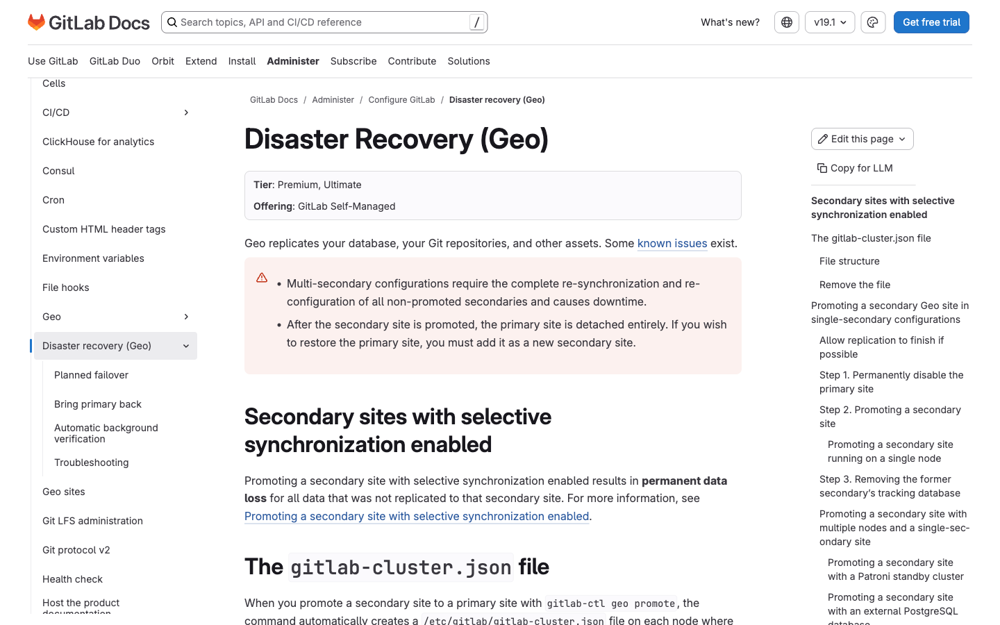
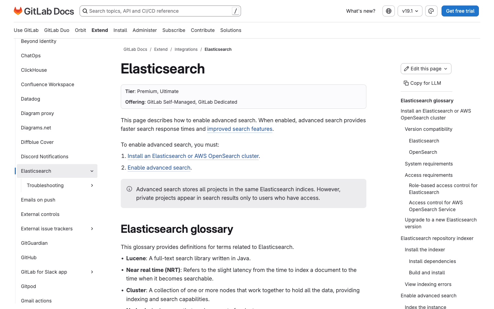
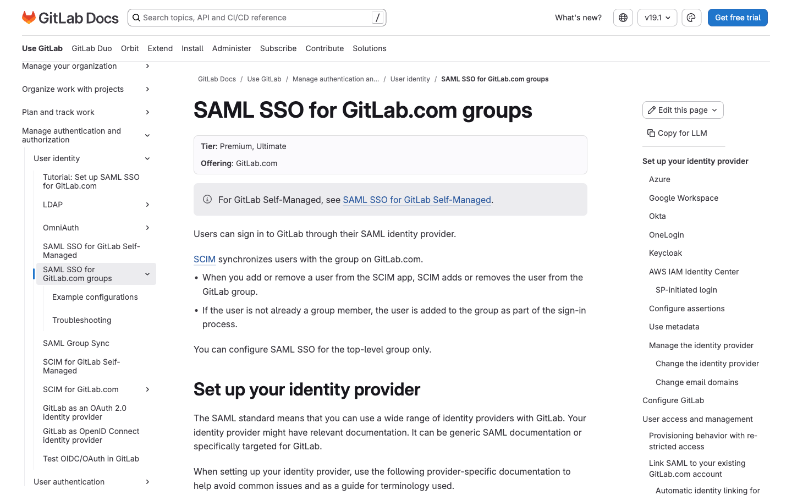
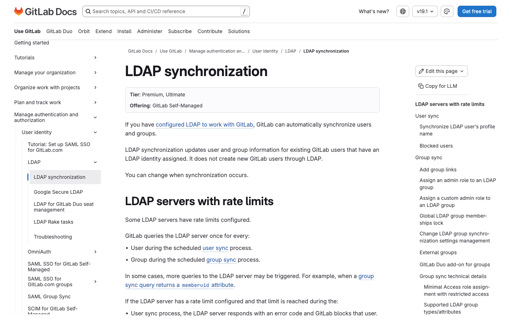
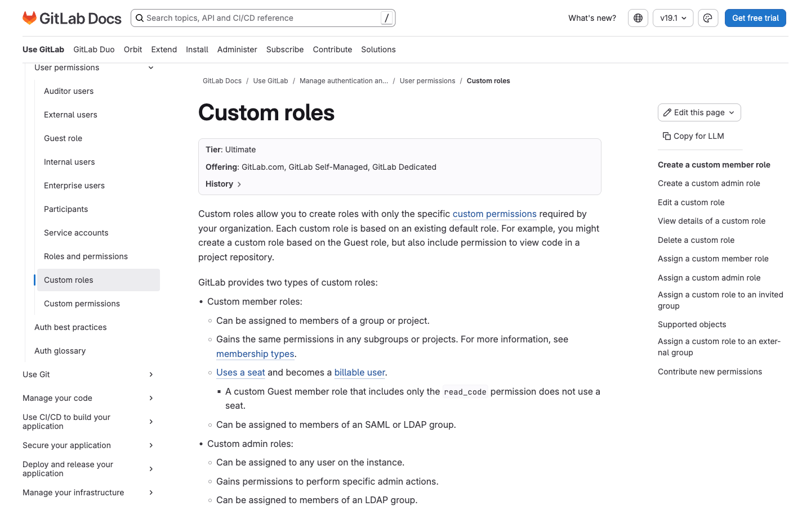
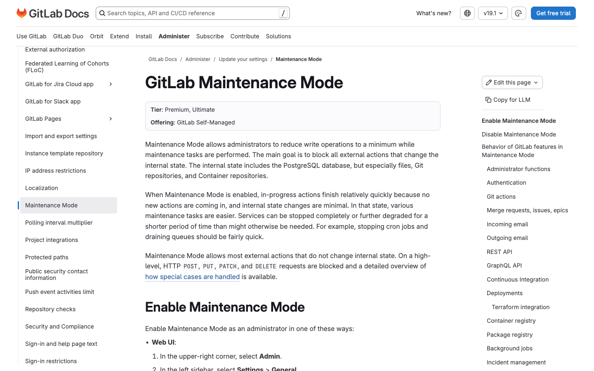
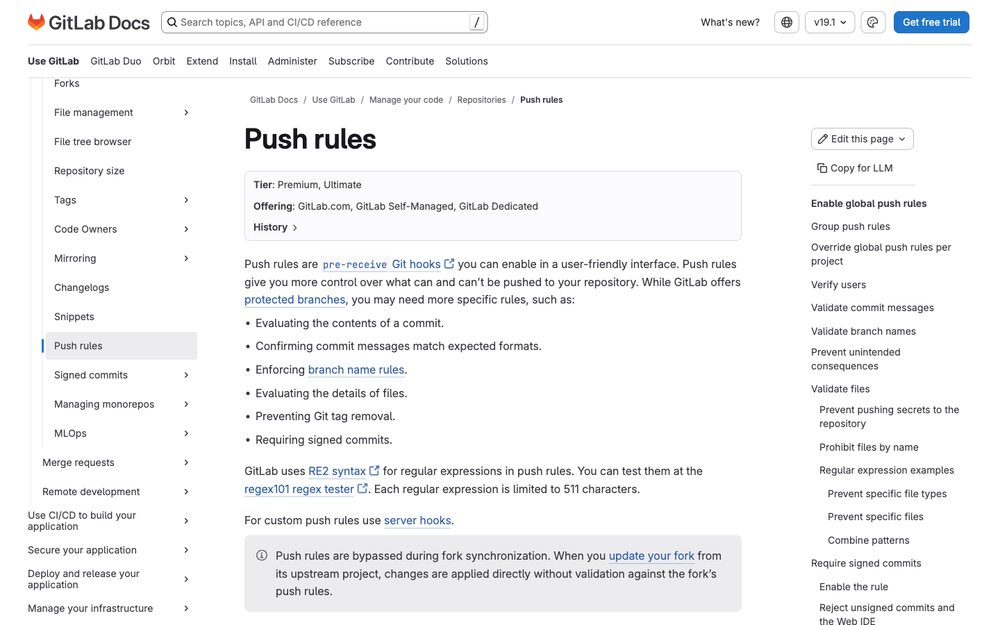

# 5. Administration, Skalabilitas & Enterprise (Self-Managed)

Fitur tier **Premium** & **Ultimate** untuk administrasi instance, skalabilitas, dan kebutuhan enterprise. Mayoritas relevan untuk **GitLab Self-Managed**. Tier diverifikasi dari docs.gitlab.com (2025/2026, hingga GitLab 18.x).

> **Catatan akurasi tier:** Beberapa fitur yang sering diasumsikan "enterprise" sebenarnya **Free** (butuh edisi EE): **Kerberos**, **Service Desk**, **Reply by email**, **Instance-level CI/CD variables**, **Admin user management/impersonate**. Lihat tabel di bawah. **Support tiers/SLA** adalah atribut paket langganan, bukan fitur produk dengan halaman konfigurasi.

---

## 5.1 GitLab Geo (Replikasi Multi-Region)

- **Tier:** Premium, Ultimate (Self-Managed)
- **WHY:** Geo mereplikasi data (database, repositori Git, LFS, artefak, registry) dari primary site ke satu/lebih secondary site di region berbeda. Ini mempercepat operasi Git (clone/fetch) bagi tim yang tersebar geografis karena membaca dari cache lokal terdekat. Geo juga menjadi fondasi solusi Disaster Recovery dengan menyediakan secondary site yang selalu tersinkronisasi (warm standby).
- **HOW TO:**
  1. Pastikan versi GitLab identik di semua site, PostgreSQL mendukung streaming replication, dan port jaringan terbuka.
  2. Di primary site, buka **Admin > Geo > Sites**, lalu set **Internal URL**.
  3. Instal GitLab di secondary site dengan versi & konfigurasi penyimpanan yang sama.
  4. Konfigurasikan PostgreSQL streaming replication dari primary ke tiap secondary.
  5. Siapkan **Geo tracking database** di tiap secondary.
  6. Aktifkan **Geo Log Cursor** daemon di secondary.
  7. Pantau progres backfill via dashboard **Admin > Geo > Sites**.
- **Docs:** https://docs.gitlab.com/administration/geo/

---

## 5.2 Disaster Recovery (Geo Failover)

- **Tier:** Premium, Ultimate (Self-Managed)
- **WHY:** Memungkinkan organisasi melanjutkan operasional saat primary site mengalami bencana (outage data center, kegagalan hardware) dengan mempromosikan secondary site menjadi primary baru. Karena data sudah tersinkronisasi terus-menerus via Geo, downtime dan kehilangan data diminimalkan. Krusial untuk memenuhi target RTO/RPO dan kepatuhan business continuity.
- **HOW TO:**
  1. (Disarankan) Lakukan **planned failover**: blokir penulisan ke primary via maintenance window dan biarkan replikasi selesai.
  2. Nonaktifkan primary secara permanen untuk mencegah split-brain.
  3. Jalankan `sudo gitlab-ctl geo promote` di node secondary.
  4. Verifikasi konektivitas ke primary baru.
  5. Hapus konfigurasi tracking database dari `/etc/gitlab/gitlab.rb`.
  6. Perbarui DNS agar mengarah ke site yang dipromosikan.
- **Docs:** https://docs.gitlab.com/administration/geo/disaster_recovery/

---

## 5.3 Advanced Search (Elasticsearch / OpenSearch)

- **Tier:** Premium, Ultimate (Self-Managed & GitLab Dedicated)
- **WHY:** Advanced Search menggantikan pencarian berbasis database dengan engine full-text Elasticsearch/OpenSearch yang dapat di-scale horizontal, memberikan respons pencarian jauh lebih cepat (umumnya < 1 detik) bahkan pada instance besar. Cakupannya meliputi kode, issue, MR, commit, komentar, wiki. Penting bagi organisasi besar dengan jutaan repositori/baris kode.
- **HOW TO:**
  1. Instal cluster Elasticsearch (7.x+) atau AWS OpenSearch (1.x+) di server terpisah.
  2. Verifikasi kompatibilitas versi engine dengan instance GitLab.
  3. Siapkan autentikasi (basic auth atau RBAC).
  4. Buka **Admin > Settings > Search**, expand **Advanced Search**.
  5. Masukkan URL cluster, username, password; atur jumlah shard & replica.
  6. Centang **Turn on indexing for advanced search** dan mulai indexing.
  7. Pantau via **Admin > Monitoring > Background jobs**.
  8. Setelah selesai, centang **Search with advanced search**.
- **Docs:** https://docs.gitlab.com/integration/advanced_search/elasticsearch/

---

## 5.4 SAML SSO untuk Group (GitLab.com) + SCIM

- **Tier:** Premium, Ultimate (GitLab.com)
- **WHY:** Group SAML SSO memungkinkan autentikasi terpusat melalui identity provider (Azure/Entra ID, Okta, Google Workspace, OneLogin, Keycloak). Pengguna login via IdP tanpa mengelola kredensial terpisah, mempermudah manajemen akses & integrasi dengan sistem identitas enterprise. **SCIM** menambah otomasi provisioning/deprovisioning user agar onboarding/offboarding tidak manual dan tidak ada akun yatim.
- **HOW TO (SAML):**
  1. Konfigurasi identity provider sesuai field mapping GitLab (NameID wajib).
  2. Buka **Settings > SAML SSO** pada group; catat URL & metadata dari GitLab.
  3. Masukkan **Identity provider single sign-on URL** dan **Certificate fingerprint** dari IdP.
  4. Tetapkan **default membership role** untuk pengguna baru.
  5. Centang **Enable SAML authentication for this group**.
  6. (Disarankan) Aktifkan enforcement SSO-only.
- **HOW TO (SCIM):** Generate **SCIM token** di **Settings > SAML SSO**, masukkan endpoint URL + token ke konfigurasi SCIM IdP, atur attribute mapping (`objectId → externalId`), lalu assign user.
- **Docs:** https://docs.gitlab.com/user/group/saml_sso/ · [SCIM](https://docs.gitlab.com/user/group/saml_sso/scim_setup/)

---

## 5.5 LDAP Synchronization (User & Group Sync)

- **Tier:** Premium, Ultimate (Self-Managed). *Autentikasi LDAP dasar ada di Free; sync user/group, external groups, admin group, multiple LDAP servers adalah Premium/Ultimate.*
- **WHY:** LDAP Sync menjaga informasi user dan keanggotaan group selalu sinkron dengan direktori (Active Directory/LDAP) tanpa pembaruan manual. User sync (harian) memperbarui profil & memblokir akun yang dihapus di LDAP; group sync (per jam) mengelola keanggotaan dan bahkan dapat memberi privilege admin otomatis. Esensial untuk konsistensi akses & kepatuhan di organisasi besar.
- **HOW TO:**
  1. Aktifkan autentikasi LDAP dasar terlebih dahulu.
  2. Set `group_base` ke container LDAP (mis. `ou=groups,dc=example,dc=com`).
  3. Buat **LDAP group links** yang memetakan group GitLab ke group LDAP.
  4. (Opsional) Konfigurasi `admin_group` agar anggotanya otomatis administrator.
  5. (Opsional) Sesuaikan jadwal cron sync (user: harian; group: per jam).
  6. Edit `/etc/gitlab/gitlab.rb` lalu reconfigure/restart GitLab.
- **Docs:** https://docs.gitlab.com/administration/auth/ldap/ldap_synchronization/

---

## 5.6 Custom Roles (Member Roles)

- **Tier:** Ultimate *(catatan: sebelumnya tersedia di Premium; per rilis terbaru menjadi Ultimate-only)*
- **WHY:** Custom roles memungkinkan organisasi membuat peran dengan hanya izin spesifik yang dibutuhkan, di luar peran default (Guest/Reporter/Developer/Maintainer/Owner). Mendukung prinsip least-privilege & kontrol izin granular, mis. memberi akses baca kode tanpa hak penuh Developer. Penting untuk pemisahan tugas & kepatuhan keamanan.
- **HOW TO:**
  1. Buka pengaturan group (GitLab.com) atau **Admin** (Self-Managed).
  2. Pilih **Settings > Roles and permissions**.
  3. Klik **New role** dan pilih **Member role**.
  4. Isi nama & deskripsi, pilih **base role**, centang izin yang diinginkan.
  5. Klik **Create role**.
  6. Assign via group/project > **Manage > Members**, pilih custom role, lalu **Update role**.
- **Docs:** https://docs.gitlab.com/user/custom_roles/

---

## 5.7 Maintenance Mode

- **Tier:** Premium, Ultimate (Self-Managed)
- **WHY:** Maintenance Mode mengurangi operasi tulis ke minimum saat tugas pemeliharaan dijalankan, dengan memblokir aksi eksternal yang mengubah state internal (database, repositori Git, registry). Memungkinkan tugas seperti failover Geo, migrasi, atau upgrade selesai lebih cepat & aman, sementara pengguna tetap bisa membaca/clone. Krusial untuk meminimalkan risiko inkonsistensi data selama maintenance.
- **HOW TO:**
  1. Buka **Admin > Settings > General**.
  2. Expand **Maintenance Mode** dan aktifkan toggle.
  3. Klik **Save changes**.
  4. Alternatif API: `PUT /api/v4/application/settings?maintenance_mode=true`.
  5. Nonaktifkan: ulangi dengan toggle off / `maintenance_mode=false`.
- **Docs:** https://docs.gitlab.com/administration/maintenance_mode/

---

## 5.8 Push Rules

- **Tier:** Premium, Ultimate (GitLab.com, Self-Managed, Dedicated)
- **WHY:** Push rules adalah pre-receive Git hooks yang dikonfigurasi lewat antarmuka ramah pengguna, memungkinkan penegakan standar seperti format pesan commit, konvensi penamaan branch, verifikasi email committer, pencegahan push file rahasia, dan pembatasan ukuran file. Menjaga kualitas & keamanan repositori secara konsisten lintas tim/instance, mengurangi error manusia sebelum kode masuk.
- **HOW TO:**
  1. **Project:** **Settings > Repository > Push rules** > atur > **Save push rules**.
  2. **Group:** **Settings > Repository > Pre-defined push rules** > atur > **Save**.
  3. **Instance:** **Admin > Push rules** > atur > **Save push rules**.
  4. Catatan: aturan project adalah salinan independen — project baru mewarisi dari parent terdekat, tetapi tidak otomatis ter-update saat aturan global berubah.
- **Docs:** https://docs.gitlab.com/user/project/repository/push_rules/

---

## Tambahan: Subscription & Seat Management

- **Tier:** Premium, Ultimate (perbedaan perlakuan seat)
- **WHY & catatan penting:** Penagihan berbasis jumlah maksimum *billable users*. **Perbedaan tier:** di **Premium**, user dengan peran **Guest** tetap memakai seat; di **Ultimate**, user Guest **tidak** memakai seat (selama tidak punya peran lebih tinggi di mana pun). Kelola via group **Settings > Usage quotas > Seats**.
- **Docs:** https://docs.gitlab.com/subscriptions/manage_seats/

---

## Fitur "Admin" yang sebenarnya FREE (bukan Premium/Ultimate)

Agar tidak salah klaim, berikut fitur yang sering dianggap berbayar namun tersedia di **Free** (edisi EE):

| Fitur | Tier sebenarnya | Docs |
|---|---|---|
| Kerberos | Free/Premium/Ultimate (butuh EE) | [docs](https://docs.gitlab.com/integration/kerberos/) |
| Service Desk | Free/Premium/Ultimate | [docs](https://docs.gitlab.com/user/project/service_desk/) |
| Reply by email | Free/Premium/Ultimate | [docs](https://docs.gitlab.com/administration/reply_by_email/) |
| Instance-level CI/CD variables | Free (butuh admin) | [docs](https://docs.gitlab.com/administration/cicd/) |
| Admin user management / impersonate | Free (butuh admin) | [docs](https://docs.gitlab.com/administration/administer_users/) |

[← Sebelumnya: Agile & Portfolio](04-agile-portfolio.md) · [Kembali ke index](README.md) · [Lanjut: GitLab Duo (AI) →](06-gitlab-duo-ai.md)
