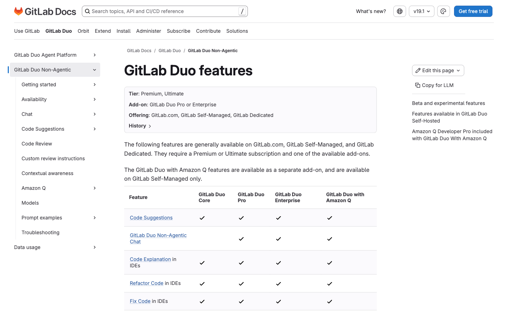
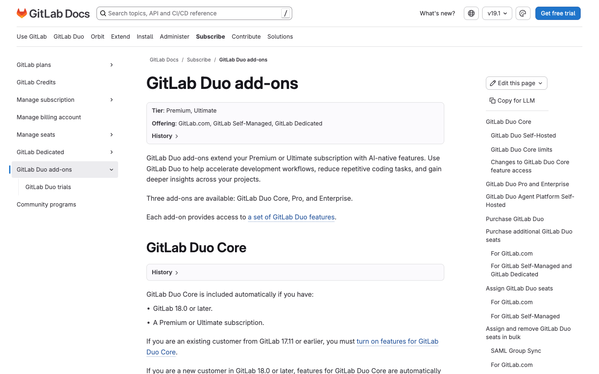
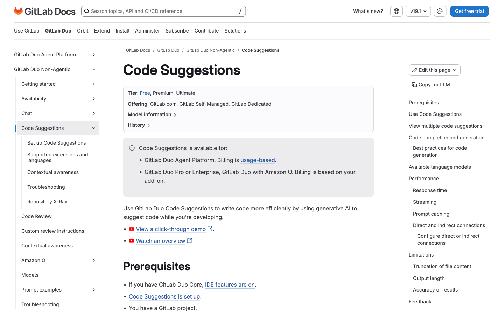
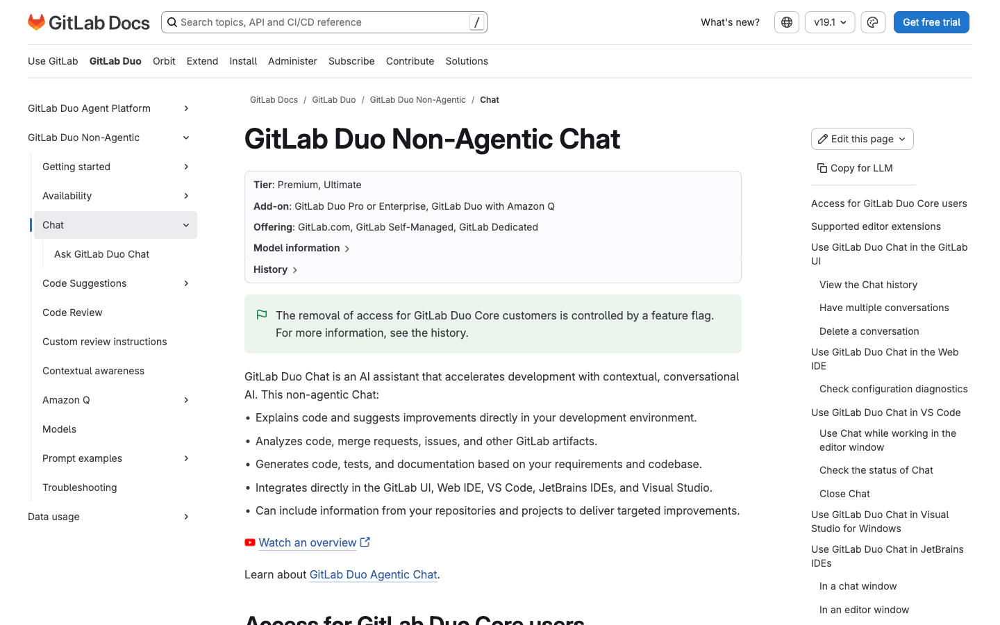
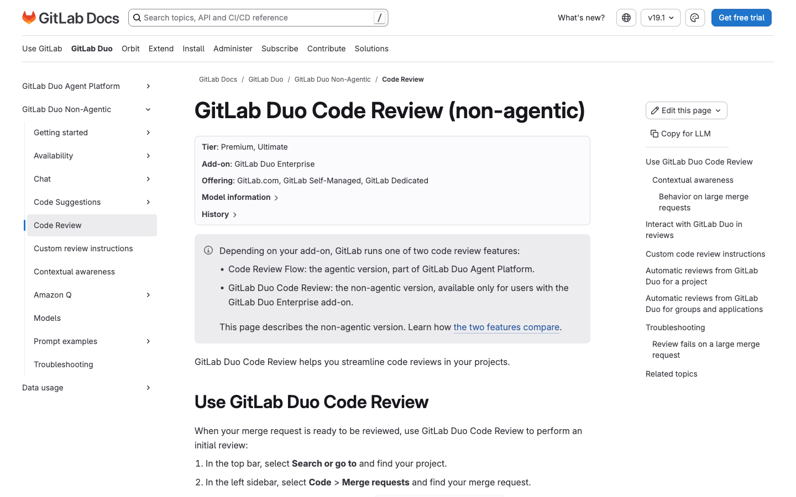
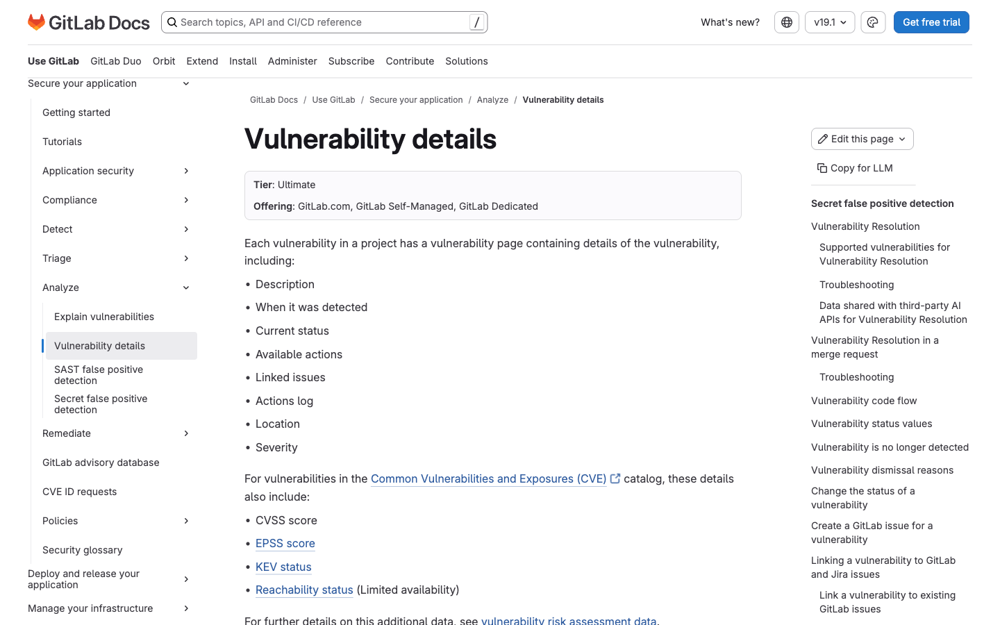

# 6. GitLab Duo (AI)

Fitur AI GitLab. Tier diverifikasi dari docs.gitlab.com (2025/2026).

> **Catatan penting tentang model lisensi AI:**
> - **Duo Core** = otomatis termasuk di **Premium/Ultimate** (GitLab 18.0+). Berisi Code Suggestions + Agentic Chat. *(Akses Chat non-agentic untuk Core berakhir 21 Mei 2026.)*
> - **Duo Pro** = add-on seat-based (di atas Premium/Ultimate).
> - **Duo Enterprise** = add-on seat-based paling lengkap — fitur keamanan AI, review, dan summary eksklusif di sini.
> - GitLab juga beralih ke skema **GitLab Duo Agent Platform berbasis GitLab Credits** ($1/credit; Premium menyertakan $12/user/bln, Ultimate $24/user/bln).

---

## 6.1 Ringkasan Fitur Duo (Matriks Tier)

Matriks resmi GitLab atas semua fitur Duo per add-on:

- **Duo Core / Pro / Enterprise:** Code Suggestions, Code Explanation (IDE), Refactor, Fix, Test Generation.
- **Duo Pro / Enterprise:** Non-Agentic Chat, Code Explanation (UI).
- **Duo Enterprise saja:** Discussion Summary, Code Review (Duo), Root Cause Analysis, Vulnerability Explanation, Vulnerability Resolution, SDLC Trends, Merge Commit Message Generation, MR Summary (Beta), Issue Description Generation (Beta).

**Docs:** https://docs.gitlab.com/user/gitlab_duo/feature_summary/

---

## 6.2 Duo Core vs Pro vs Enterprise (Add-ons)

- **Tier:** Semua butuh Premium/Ultimate; Pro & Enterprise bersifat seat-based.
- **WHY:** Menentukan add-on yang tepat penting untuk biaya & kepatuhan. **Pro** fokus produktivitas developer (Code Suggestions, Chat, Code Explanation). **Enterprise** menambah fitur keamanan AI, review, dan summary lintas SDLC, serta menjadi syarat untuk **Self-Hosted Models**.
- **HOW TO (memilih & mengaktifkan):**
  1. Tentukan kebutuhan: hanya bantuan coding → Pro; butuh vulnerability resolution, Code Review AI, root cause analysis, summary → Enterprise.
  2. Beli seat Duo Pro via Customers Portal; Duo Enterprise via GitLab Sales.
  3. Di Admin/Group: buka **Settings > GitLab Duo** dan assign seat ke anggota (mendukung bulk + LDAP/SAML).
  4. Verifikasi fitur aktif lewat halaman GitLab Duo settings.
- **Docs:** https://docs.gitlab.com/subscriptions/subscription-add-ons/

---

## 6.3 Code Suggestions (Completion & Generation)

- **Tier / add-on:** Premium/Ultimate + Duo Core/Pro/Enterprise.
- **WHY:** Mempercepat penulisan kode dengan saran otomatis baris-per-baris (*completion*) maupun blok kode utuh dari komentar bahasa natural (*generation*). Mengurangi context-switching & pencarian boilerplate sehingga developer fokus pada logika bisnis. Mendukung banyak bahasa dan terintegrasi langsung di IDE.
- **HOW TO:**
  1. Pastikan GitLab 17.2+ (disarankan 18.0+) dan Duo aktif.
  2. Pasang ekstensi GitLab di IDE (VS Code, JetBrains, Visual Studio, Neovim) dan login.
  3. **Completion:** ketik kode seperti biasa; saran muncul sebagai teks abu-abu.
  4. **Generation:** tulis komentar deskriptif (mis. `# buat fungsi validasi email`) lalu Enter.
  5. **Tab** untuk menerima, **Cmd/Ctrl + →** untuk sebagian, **Esc** untuk menolak.
- **Docs:** https://docs.gitlab.com/user/project/repository/code_suggestions/

---

## 6.4 GitLab Duo Chat

- **Tier / add-on:** Premium/Ultimate + Duo Pro atau Enterprise (akses Duo Core untuk Chat non-agentic berakhir 21 Mei 2026).
- **WHY:** Asisten AI percakapan yang menjawab pertanyaan seputar kode, proyek, isu, dan dokumentasi GitLab tanpa keluar dari alur kerja. Membantu memahami kode asing, men-debug, dan belajar fitur GitLab secara kontekstual. Tersedia di UI web maupun IDE.
- **HOW TO:**
  1. Di GitLab UI: klik ikon **GitLab Duo Chat** (tersedia di semua halaman sejak 18.5).
  2. Ketik pertanyaan lalu Enter/Send.
  3. Gunakan slash command: `/explain`, `/refactor`, `/fix`, `/tests`, `/reset`, `/new`.
  4. Di IDE: buka panel Chat lewat sidebar atau shortcut (Alt+D / Option+D).
- **Docs:** https://docs.gitlab.com/user/gitlab_duo_chat/

---

## 6.5 GitLab Duo Code Review

- **Tier / add-on:** Premium/Ultimate + Duo Enterprise.
- **WHY:** Memberi review awal otomatis pada MR (saran perbaikan, potensi bug, gaya kode) sehingga reviewer manusia bisa fokus hal substansial. Mempercepat siklus review dan meningkatkan konsistensi. Mendukung instruksi review kustom.
- **HOW TO:**
  1. Buka **Code > Merge requests** dan pilih MR.
  2. Assign **GitLab Duo** sebagai reviewer, atau ketik `/assign_reviewer @GitLabDuo`.
  3. Tunggu Duo memberi komentar review pada diff.
  4. Mention `@GitLabDuo` untuk pertanyaan lanjutan.
  5. (Opsional) Maintainer aktifkan otomatis di **Settings > Merge requests > GitLab Duo Code Review**.
- **Docs:** https://docs.gitlab.com/user/gitlab_duo/code_review/

---

## 6.6 Vulnerability Explanation & Resolution (AI)

- **Tier / add-on:** Ultimate + Duo Enterprise.
- **WHY:** **Vulnerability Explanation** menjelaskan kerentanan dalam bahasa mudah dipahami (dampak & cara eksploitasi), mempercepat triase. **Vulnerability Resolution** menghasilkan saran perbaikan dan langsung membuat MR yang menyelesaikan kerentanan SAST — menutup celah keamanan jauh lebih cepat tanpa keahlian mendalam.
- **HOW TO:**
  1. Buka **Secure > Vulnerability report** pada proyek.
  2. Pilih kerentanan untuk membuka detail.
  3. Klik **Explain with AI** untuk penjelasan, atau **Resolve with AI** untuk membuat MR perbaikan.
  4. Tinjau MR yang dibuat, jalankan pipeline, verifikasi kerentanan hilang, update status.
- **Docs:** https://docs.gitlab.com/user/application_security/vulnerabilities/

---

## Fitur Duo Enterprise Lain (tanpa screenshot terpisah)

| Fitur | Tier / add-on | Ringkasan |
|---|---|---|
| **Root Cause Analysis** | Duo Enterprise | Analisis log job CI/CD gagal + contoh fix. Klik **Troubleshoot** pada job log. |
| **MR / Code Review Summary** | Duo Enterprise (Beta) | Ringkasan otomatis komentar review via **Finish review > Add Summary**. |
| **Discussion Summary** | Duo Enterprise | Ringkas diskusi panjang pada issue. |
| **Test/Refactor/Fix (IDE)** | Duo Core/Pro/Enterprise | `/tests`, `/refactor`, `/fix` pada kode terpilih di IDE. |

[← Sebelumnya: Administration & Enterprise](05-administration-enterprise.md) · [Kembali ke index](README.md) · [Lanjut: Package & Release →](07-package-registry-release.md)
