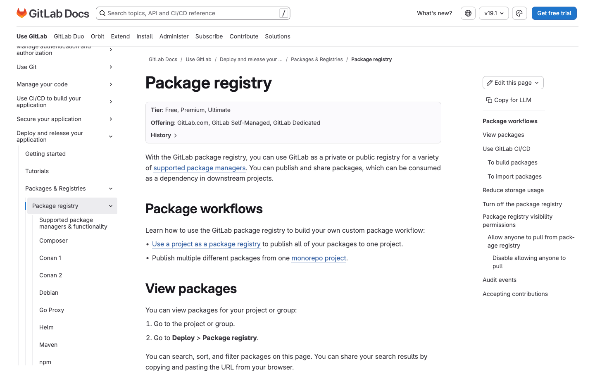
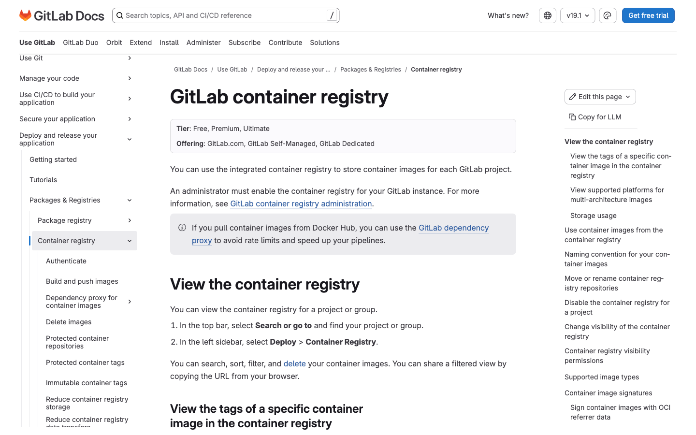
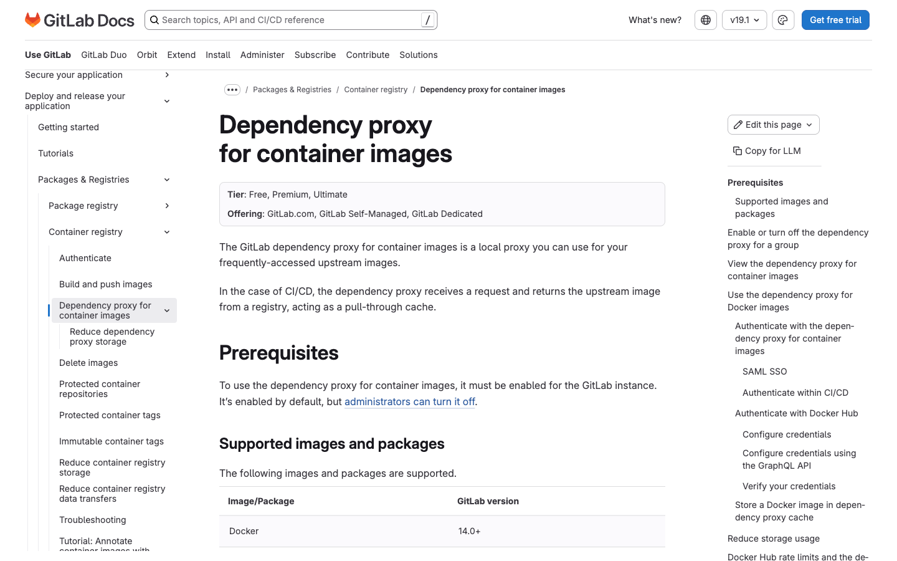
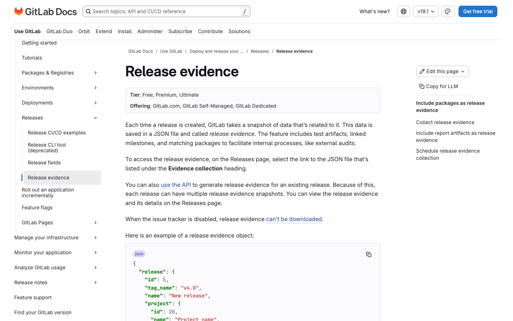

# 7. Package, Registry & Release Management

Fitur penyimpanan artefak, registry, dan manajemen rilis. Tier diverifikasi dari docs.gitlab.com (2025/2026).

> **Catatan akurasi tier:** Package Registry, Container Registry, dan Dependency Proxy (containers) tersedia hingga **Free**. Hanya **Dependency Proxy for packages**, **Release Evidence**, dan **Virtual Registry (Beta)** yang Premium/Ultimate.

---

## 7.1 Package Registry (npm, Maven, PyPI, NuGet, dll.)

- **Tier:** Free, Premium, Ultimate
- **WHY:** GitLab berfungsi sebagai registry privat/publik untuk banyak package manager. Menyatukan kode dan artefak dependensi dalam satu platform sehingga dependency management lebih aman & terlacak. Mendukung publikasi otomatis via CI/CD.
- **HOW TO:**
  1. Buka **Deploy > Package registry** untuk melihat package.
  2. Autentikasi dengan `CI_JOB_TOKEN` (CI/CD), personal access token, atau project/deploy token.
  3. Konfigurasi package manager (mis. npm set registry ke endpoint GitLab; Maven tambahkan repository di `pom.xml`).
  4. Publish via pipeline (`npm publish` / `mvn deploy`).
  5. Install dengan menyalin snippet dari UI registry.
- **Docs:** https://docs.gitlab.com/user/packages/package_registry/

---

## 7.2 Container Registry

- **Tier:** Free, Premium, Ultimate
- **WHY:** Menyimpan image kontainer Docker per proyek di dalam GitLab, terintegrasi dengan CI/CD & keamanan. Menghindari registry pihak ketiga dan menyederhanakan alur build-deploy. Mendukung cleanup policy otomatis.
- **HOW TO:**
  1. Buka **Deploy > Container Registry** pada proyek.
  2. Autentikasi: `docker login registry.example.com` dengan token.
  3. Build & tag: `docker build -t registry.example.com/namespace/project:tag .`
  4. Push: `docker push registry.example.com/namespace/project:tag`
  5. Kelola image di UI; pull dengan **Copy image path** lalu `docker pull`.
- **Docs:** https://docs.gitlab.com/user/packages/container_registry/

---

## 7.3 Dependency Proxy

- **Tier:** **Containers** = Free/Premium/Ultimate. **Packages (Maven/Gradle/SBT)** = **Premium, Ultimate**.
- **WHY:** Dependency Proxy adalah pull-through cache untuk image/package upstream (mis. Docker Hub, Maven Central) yang sering dipakai. Mempercepat pipeline, menghindari rate-limit registry publik, dan memberi ketahanan saat upstream down.
- **HOW TO (containers):**
  1. Buka grup, lalu **Settings > Packages and registries**.
  2. Expand **Dependency Proxy**, aktifkan **Enable Proxy** (Owner grup).
  3. Buka **Operate > Dependency Proxy**, salin prefix image.
  4. Pakai prefix di `.gitlab-ci.yml`/`Dockerfile`, mis. `gitlab.example.com/grup/dependency_proxy/containers/alpine:latest`.
  5. Autentikasi dengan kredensial GitLab/token saat pull.
- **HOW TO (packages — Premium/Ultimate):** isi **Remote registry URL** di **Settings > Packages and registries > Package registry**, siapkan autentikasi, arahkan client (mis. Maven) ke endpoint dependency proxy packages.
- **Docs:** https://docs.gitlab.com/user/packages/dependency_proxy/

---

## 7.4 Release Evidence

- **Tier:** Premium, Ultimate (Self-Managed & Dedicated)
- **WHY:** Release Evidence mengambil snapshot data rilis (artefak test, milestone terkait, package) ke file JSON saat rilis dibuat. Penting untuk audit eksternal & kepatuhan, memberi jejak bukti yang tidak dapat diubah. Otomatis dikumpulkan tiap rilis.
- **HOW TO:**
  1. Buat rilis (otomatis memicu pengumpulan evidence).
  2. Buka **Deploy > Releases**, pilih rilis, lihat bagian **Evidence** untuk mengunduh JSON.
  3. Untuk evidence tambahan pada rilis existing, panggil **Release Evidence API** (`POST .../releases/:tag/evidence`).
- **Docs:** https://docs.gitlab.com/user/project/releases/release_evidence/

---

## Fitur Package/Release Lain

| Fitur | Tier | Ringkasan |
|---|---|---|
| **Releases (inti)** | Free/Premium/Ultimate | Bungkus tag Git jadi rilis dengan release notes, milestone, aset. ([docs](https://docs.gitlab.com/user/project/releases/)) |
| **Virtual Registry (Beta)** | Premium, Ultimate | Satukan beberapa registry upstream di balik satu endpoint virtual. ([docs](https://docs.gitlab.com/user/packages/virtual_registry/)) |

[← Sebelumnya: GitLab Duo (AI)](06-gitlab-duo-ai.md) · [Kembali ke index](README.md)
