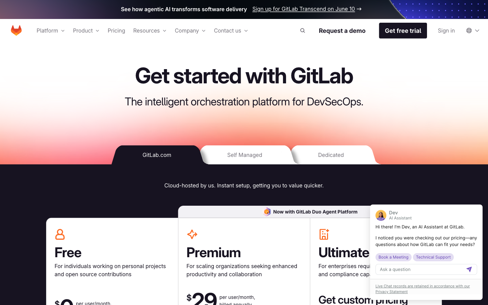

# Panduan Fitur GitLab Premium & Ultimate (Enterprise)

Dokumen **how-to & why** untuk seluruh fitur GitLab tier **Premium** dan **Ultimate** (Enterprise), lengkap dengan screenshot dari dokumentasi resmi GitLab.

- **Bahasa:** Indonesia
- **Cakupan:** Premium + Ultimate (dengan catatan fitur yang sebenarnya Free agar tidak salah klaim)
- **Sumber:** `docs.gitlab.com` & `about.gitlab.com` (data 2025/2026)
- **Tanggal disusun:** 7 Juni 2026
- **Screenshot:** diambil otomatis via Playwright dari halaman dokumentasi publik GitLab → folder [`screenshots/`](screenshots/)

> ⚠️ **Disclaimer penting:** Screenshot di dokumen ini berasal dari **halaman dokumentasi publik GitLab** (bukan UI fitur live di instance berlisensi), sesuai sumber yang dipilih. Setiap screenshot menampilkan judul fitur beserta **badge "Tier"** resmi GitLab, sehingga tetap menjadi rujukan akurat atas ketersediaan tier. Tier produk dapat berubah antar rilis — selalu verifikasi pada halaman docs yang ditautkan.

---

## 📚 Daftar Isi (per kategori)

| # | Kategori | Isi utama |
|---|---|---|
| 1 | [Source Code Management & Code Review](01-source-code-management.md) | Approval rules, Code Owners, protected branches, file lock, MR dependencies |
| 2 | [CI/CD & Pipelines](02-cicd.md) | Merge trains, merged results, protected environments, deployment approvals, external repos |
| 3 | [Security & Compliance (DevSecOps)](03-security-compliance.md) | SAST, DAST, dependency/container scanning, security dashboard, policies, compliance, audit |
| 4 | [Agile Planning & Portfolio Management](04-agile-portfolio.md) | Epics, roadmap, iterations, boards, scoped labels, OKRs, VSA, burndown |
| 5 | [Administration, Skalabilitas & Enterprise](05-administration-enterprise.md) | Geo, disaster recovery, advanced search, SAML/SCIM, LDAP sync, custom roles, push rules |
| 6 | [GitLab Duo (AI)](06-gitlab-duo-ai.md) | Code Suggestions, Chat, Code Review AI, vulnerability explanation/resolution |
| 7 | [Package, Registry & Release](07-package-registry-release.md) | Package/container registry, dependency proxy, release evidence |

---

## 💰 Harga & Positioning Tier (per 7 Juni 2026, USD)

| Tier | Harga (per user/bulan) | Untuk siapa | Fokus |
|---|---|---|---|
| **Free** | **$0** | Individu, open source, tim kecil | SCM + CI/CD dasar tanpa biaya |
| **Premium** | **$29** (billed annually) | Tim/organisasi berkembang | Produktivitas, koordinasi, code governance, CI/CD lanjutan, SLA support |
| **Ultimate** | **Custom / contact sales** (harga list historis: **$99**) | Enterprise | DevSecOps menyeluruh, portfolio/value stream, AI canggih, support enterprise |

**Catatan harga:**
- Halaman pricing GitLab kini menampilkan Free **$0** dan Premium **$29** secara langsung; **Ultimate diarahkan ke "contact sales"**. Angka **$99** adalah harga list historis yang masih dikutip luas — bukan kuotasi resmi terbaru. Verifikasi ke sales GitLab.
- Harga **sama** untuk SaaS (GitLab.com) dan Self-Managed. Langganan **tidak dapat dipindahkan** antar keduanya.
- **GitLab Duo Core** termasuk otomatis di Premium/Ultimate (GitLab 18.0+).
- **GitLab Credits** (Duo Agent Platform): **$1/credit**; Premium menyertakan **$12/user/bln**, Ultimate **$24/user/bln**.
- Add-on **Enterprise Agile Planning**: **$15/user/bulan** (annual).
- GitLab menyediakan **Ultimate gratis** + 50K compute minutes/bln untuk open source berkualifikasi, institusi pendidikan, dan startup.

**Sumber harga:** [about.gitlab.com/pricing](https://about.gitlab.com/pricing/) · [Premium](https://about.gitlab.com/pricing/premium/) · [Ultimate](https://about.gitlab.com/pricing/ultimate/) · [Feature comparison](https://about.gitlab.com/pricing/feature-comparison/)

---

## 🧩 Edisi: Community Edition (CE) vs Enterprise Edition (EE)

CE/EE adalah **pilihan distribusi/edisi**, bukan tier harga. Tier (Free/Premium/Ultimate) adalah **model lisensi** di atas distribusi tersebut.

- **Community Edition (CE):** sepenuhnya open source (lisensi MIT). Hanya berisi fitur tier Free.
- **Enterprise Edition (EE):** *source-available* di bawah lisensi komersial. Berisi seluruh kode fitur berbayar, **tetapi terkunci** sampai diaktivasi dengan kode lisensi.
- Tanpa lisensi aktif, **EE berfungsi persis seperti CE** (hanya fitur Free). Untuk membuka Premium/Ultimate pada self-managed, jalankan **EE** lalu aktivasi dengan kode lisensi tier terkait.
- Praktik yang dianjurkan GitLab: pasang **EE** (jalan sebagai Free) agar mudah di-upgrade tanpa migrasi distribusi.

> "GitLab Enterprise" dalam permintaan umumnya merujuk pada **EE** dan/atau tier **Ultimate** — keduanya dibahas di dokumen ini.

---

## 📊 Tabel Ringkas Fitur Kunci per Kategori

Legenda: ✅ tersedia · ⬆️ versi lebih lengkap · ❌ tidak tersedia

| Kategori | Fitur (contoh) | Free | Premium | Ultimate |
|---|---|:---:|:---:|:---:|
| **SCM / Code Review** | Git repo, MR, push rules dasar | ✅ | ✅ | ✅ |
| | MR approval rules lanjutan, Code Owner approval | ❌ | ✅ | ✅ |
| | Protected branch granular, file lock UI, MR dependencies | ❌ | ✅ | ✅ |
| **CI/CD** | Built-in CI/CD, multi-project pipelines | ✅ | ✅ | ✅ |
| | Merge trains, merged results, protected environments, deployment approvals | ❌ | ✅ | ✅ |
| | Compute minutes (indikatif SaaS) | ~400/bln | ~10.000/bln | ~50.000/bln |
| **Security & Compliance** | SAST/Secret/Container scanning (dasar) | ✅ | ✅ | ✅ |
| | DAST, dependency scanning, security dashboard, vuln report, policies | ❌ | ❌ | ✅ |
| | Compliance center & frameworks, audit events grup/proyek | ❌ | ✅ | ⬆️ |
| **Agile / Portfolio** | Issues, board dasar | ✅ | ✅ | ✅ |
| | Epics, roadmap, iterations, scoped labels, weights | ❌ | ✅ | ✅ |
| | Multi-level epics, OKRs, health status, requirements, insights, DORA | ❌ | ❌ | ✅ |
| **Admin / Geo** | Audit events, compliance visibility | ❌ | ✅ | ⬆️ |
| | Geo, disaster recovery, advanced search, SAML/SCIM, LDAP sync, push rules | ❌ | ✅ | ✅ |
| | Custom roles | ❌ | ❌ | ✅ |
| **GitLab Duo (AI)** | Duo Core (Code Suggestions + Agentic Chat) | ❌ | ✅ | ✅ |
| | Duo Enterprise (Code Review AI, vuln resolution, RCA, summaries) | ❌ | add-on | add-on |
| **Package / Release** | Package & container registry, dependency proxy (containers) | ✅ | ✅ | ✅ |
| | Dependency proxy (packages), release evidence, virtual registry | ❌ | ✅ | ✅ |

> Catatan: beberapa fitur berpindah tier antar rilis. Tabel ini ringkasan; detail & tier per-fitur ada di tiap halaman kategori.

---

## 🖼️ Tentang Screenshot

Seluruh screenshot (49 file) berada di [`screenshots/`](screenshots/), diambil otomatis menggunakan **Playwright** dari halaman dokumentasi publik GitLab. Penamaan: `{kategori}-{nomor}-{fitur}.png` (mis. `sec-03-dast.png`). Setiap file menampilkan judul fitur dan badge tier resmi.

Untuk memperbarui screenshot dengan UI live (butuh instance GitLab Premium/Ultimate berlisensi + kredensial), beri tahu — alur Playwright tinggal diarahkan ke instance Anda dan login.

---

## ✅ Catatan Akurasi Tier (ringkasan)

Beberapa fitur yang sering disalahklasifikasikan (sudah diverifikasi):
- **Sudah Free** (bukan Premium): multi-project pipelines, parent-child pipelines, MR pipelines, scheduled pipelines, batch suggestions, exclusive LFS lock, Kerberos, Service Desk, Reply by email.
- **Turun ke Premium** (dulu Ultimate): Epics, Roadmap, multiple assignees, issue weights, scoped labels.
- **Naik/tetap Ultimate-only**: Custom roles (dulu Premium), DAST, dependency scanning, security dashboard, vulnerability report, security policies, OKRs, health status, requirements, insights, DORA metrics, multi-level epics.
- **Add-on Duo Enterprise**: Code Review AI, vulnerability explanation/resolution, root cause analysis, MR/discussion summary.
